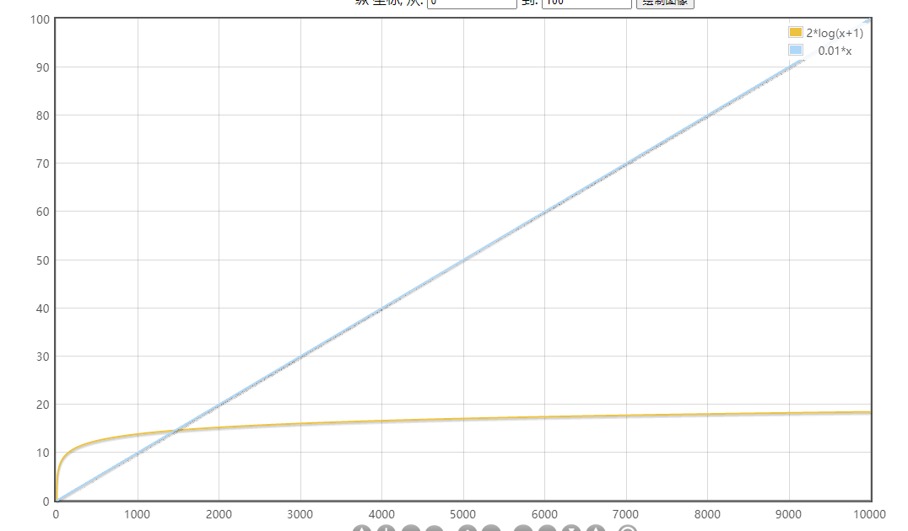

### HashMap源码解析（JDK8）

#### 数据结构

##### 1. 数组：

​	采用连续的存储单元来存储信息。使用下标查找，时间复杂度为O(1)；根据给定值查找，时间复杂度为O(n)；插入删除操作，时间复杂度为O(n);

##### 2. 链表：

​	通过指针把不连续的内存空间连接在一起的一种数据结构。每个内存空间称作一个节点。节点除了存储数据本身，还需要存储上、下节点的地址，即，前驱指针prev、后继指针next。

查找的时间复杂度为O(n)；对于新增和删除，时间复杂度为O(1)；

##### 3. 哈希表：

​	根据关键码值(Key value)而直接进行访问的[数据结构](https://baike.baidu.com/item/数据结构/1450)。也就是说，它通过把关键码值映射到表中一个位置来访问记录，以加快查找的速度。这个映射函数叫做[散列函数](https://baike.baidu.com/item/散列函数/2366288)，存放记录的[数组](https://baike.baidu.com/item/数组/3794097)叫做[散列表](https://baike.baidu.com/item/散列表/10027933)。

查找，插入，删除操作的时间复杂度(不考虑哈希冲突的情况)均为O(1)；

##### 4. 二叉树：

对平衡有序二叉树进行插入、删除、查找操作，复杂度为O(logn)；

##### 查询性能：

数组 > 哈希表 > 二叉树 >  链表

#### 字段：

```java
// 哈希表（数组）
transient Node<K,V>[] table;
// 
transient Set<Map.Entry<K,V>> entrySet;
// 记录键值对的数目
transient int size;
// 结构上修改的次数
transient int modCount;
// 扩容阈值
int threshold;
// 哈希表的装载因子
final float loadFactor;
```

#### 方法：

##### 1. 构造器：

###### 无参构造器：

```java
public HashMap() {
    this.loadFactor = DEFAULT_LOAD_FACTOR; // all other fields defaulted
}
```

###### 有参构造器：

```java
public HashMap(int initialCapacity) {
    this(initialCapacity, DEFAULT_LOAD_FACTOR);
}

public HashMap(int initialCapacity, float loadFactor) {
    if (initialCapacity < 0)
        throw new IllegalArgumentException("Illegal initial capacity: " +
                                           initialCapacity);
    if (initialCapacity > MAXIMUM_CAPACITY) // MAXIMUM_CAPACITY= 1 << 30
        initialCapacity = MAXIMUM_CAPACITY;
    if (loadFactor <= 0 || Float.isNaN(loadFactor))
        throw new IllegalArgumentException("Illegal load factor: " +
                                           loadFactor);
    this.loadFactor = loadFactor;
    this.threshold = tableSizeFor(initialCapacity);
}
```

###### 求目标容量:

```java
static final int tableSizeFor(int cap) {
    int n = cap - 1;
    n |= n >>> 1;
    n |= n >>> 2;
    n |= n >>> 4;
    n |= n >>> 8;
    n |= n >>> 16;
    return (n < 0) ? 1 : (n >= MAXIMUM_CAPACITY) ? MAXIMUM_CAPACITY : n + 1;
}
```

思路：

给定一个正整数，求大于等于它的最小2的幂的数。如果换成二进制的思维：

给定一个包含1的数，如 ：0100 1000 1010，目标数等于：0111 1111 1111 + 1 = 1000 0000 0000

即从最高位1开始，将低位全变成1.

n |= n >>> 1; 的意思就是用最高位1，使最高位的右邻位也变为1。此时，n 就最高位有两个1。0110

因此才有 n |= n >>> 2；也让第3，4位也为1；

---------------------------

​								n = 0100 1000 1010

n |= n >>> 1;		 n = 0110 XXXX XXXX

n |= n >>> 2;		 n = 0111 1XXX XXXX

n |= n >>> 4;		 n = 0111 1111 1XXX

n |= n >>> 8;		 n = 0111 1111 1111

n |= n >>> 16;	  n = 0111 1111 1111

##### 2. 添加：

```java
// put
public V put(K key, V value) {
    return putVal(hash(key), key, value, false, true);
}

// 添加到特定位置
final V putVal(int hash, K key, V value, boolean onlyIfAbsent,
                   boolean evict) {
    Node<K,V>[] tab; Node<K,V> p; int n, i;
    if ((tab = table) == null || (n = tab.length) == 0)
        // 当table为空时，创建哈希表
        n = (tab = resize()).length;
    if ((p = tab[i = (n - 1) & hash]) == null)
        // 当指定下标下未存值时，插入新值
        tab[i] = newNode(hash, key, value, null);
    else {
        Node<K,V> e; K k;
        if (p.hash == hash &&
            ((k = p.key) == key || (key != null && key.equals(k))))
            // 当该桶位有值，且（新k与旧key相等或equals相等）。则替换旧值value;
            e = p;
        else if (p instanceof TreeNode)
            // 如果当前节点是 TreeNode，则添加到红黑树结构中
            e = ((TreeNode<K,V>)p).putTreeVal(this, tab, hash, key, value);
        else {
            // 如果当前桶位的k != key并且 k.equals(key)不相等
            for (int binCount = 0; ; ++binCount) {
                // 如果当前节点的下一节点为null，则当前的下一节点指向生成的新节点
                if ((e = p.next) == null) {
                    p.next = newNode(hash, key, value, null);
                    // TREEIFY_THRESHOLD = 8
                    if (binCount >= TREEIFY_THRESHOLD - 1) // -1 for 1st
                        treeifyBin(tab, hash);   // 当链表长度> TREEIFY_THRESHOLD时，尝试树化
                    break;
                }
                if (e.hash == hash &&
                    ((k = e.key) == key || (key != null && key.equals(k))))
                    break;
                p = e;
            }
        }
        if (e != null) { // existing mapping for key
            V oldValue = e.value;
            if (!onlyIfAbsent || oldValue == null)
                e.value = value;
            afterNodeAccess(e);
            return oldValue;
        }
    }
    ++modCount;
    // 当节点数量大于阈值时，扩容
    if (++size > threshold)
        resize();
    afterNodeInsertion(evict);
    return null;
}
```

##### 3. 哈希算法：

```java
// hash算法
static final int hash(Object key) {
    int h;
    // 扰动函数,使hash映射到数组下标更加的均匀。
    return (key == null) ? 0 : (h = key.hashCode()) ^ (h >>> 16);
}
```

思考：为什么使用^ 而不是& 或者 | ？

来看看这三种运算的真值表：

| & 运算 |  1   |  0   |
| :----: | :--: | :--: |
|   1    |  1   |  0   |
|   0    |  0   |  0   |

与运算结果概率：**1** : **0** = 1 : 3

| \| 运算 |  1   |  0   |
| :-----: | :--: | :--: |
|    1    |  0   |  1   |
|    0    |  1   |  1   |

或运算结果概率：**1** : **0** = 3 : 1

| ^ 运算 |  1   |  0   |
| :----: | :--: | :--: |
|   1    |  0   |  1   |
|   0    |  1   |  0   |

异或运算结果概率：**1** : **0** = 1 : 1

所以，采用异或运算，hash值的分布保持不变

##### 4. 数组下标算法

```java
i = (n - 1) & hash
```

思路：

利用 n - 1 作为掩码 来计算出hash的后n位 n为2的m次幂时，n - 1 才是m位的1。

##### 5. 扩容

```java
// 哈希表
final Node<K,V>[] resize() {
    Node<K,V>[] oldTab = table;
    int oldCap = (oldTab == null) ? 0 : oldTab.length;
    int oldThr = threshold;
    int newCap, newThr = 0;
    // 根据旧容量大小，和阈值，进行扩容
    if (oldCap > 0) {
        if (oldCap >= MAXIMUM_CAPACITY) {
            threshold = Integer.MAX_VALUE;
            return oldTab;
        }
        else if ((newCap = oldCap << 1) < MAXIMUM_CAPACITY &&
                 oldCap >= DEFAULT_INITIAL_CAPACITY)
            newThr = oldThr << 1; // double threshold
    }
    else if (oldThr > 0) // initial capacity was placed in threshold
        newCap = oldThr;
    else {               // zero initial threshold signifies using defaults
        newCap = DEFAULT_INITIAL_CAPACITY;
        newThr = (int)(DEFAULT_LOAD_FACTOR * DEFAULT_INITIAL_CAPACITY);
    }
    if (newThr == 0) {
        float ft = (float)newCap * loadFactor;
        newThr = (newCap < MAXIMUM_CAPACITY && ft < (float)MAXIMUM_CAPACITY ?
                  (int)ft : Integer.MAX_VALUE);
    }
    threshold = newThr;
    @SuppressWarnings({"rawtypes","unchecked"})
    // 创建新数组，并重新映射数组下标
    Node<K,V>[] newTab = (Node<K,V>[])new Node[newCap];
    table = newTab;
    if (oldTab != null) {
        for (int j = 0; j < oldCap; ++j) {
            Node<K,V> e;
            if ((e = oldTab[j]) != null) {
                oldTab[j] = null;
                if (e.next == null)
                    newTab[e.hash & (newCap - 1)] = e;
                else if (e instanceof TreeNode)
                    // 对树中结点重新分配到新桶位
                    ((TreeNode<K,V>)e).split(this, newTab, j, oldCap);
                else { // preserve order
                    Node<K,V> loHead = null, loTail = null;
                    Node<K,V> hiHead = null, hiTail = null;
                    Node<K,V> next;
                    do {
                        next = e.next;
                        if ((e.hash & oldCap) == 0) {// 桶位不变，生成低位链表loHead
                            if (loTail == null)
                                loHead = e;
                            else
                                loTail.next = e;
                            loTail = e;
                        }
                        else {// 桶位改变，生成高位链表
                            if (hiTail == null)
                                hiHead = e;
                            else
                                hiTail.next = e;
                            hiTail = e;
                        }
                    } while ((e = next) != null);
                    if (loTail != null) {
                        loTail.next = null;
                        newTab[j] = loHead; // 低位链表放在原桶位
                    }
                    if (hiTail != null) {
                        hiTail.next = null;
                        newTab[j + oldCap] = hiHead;// 高位链表放在原桶位 + oldCap
                    }
                }
            }
        }
    }
    return newTab;
}
```

##### 6. 树化

```java
final void treeifyBin(Node<K,V>[] tab, int hash) {
    int n, index; Node<K,V> e;
    // 这里注意：并不是一定会转化成红黑树。当桶数小于 64时，而是采用扩容方式减少链表长度；
    // 链表过长不是树化的充分条件。当桶数较小时（如设置装载因子大于1，或者更大），哈希碰撞很频繁，	 // 这时扩容才是减小链表长度的最佳选择
    if (tab == null || (n = tab.length) < MIN_TREEIFY_CAPACITY)
        resize();
    else if ((e = tab[index = (n - 1) & hash]) != null) {
        TreeNode<K,V> hd = null, tl = null;
        do {
            TreeNode<K,V> p = replacementTreeNode(e, null);
            if (tl == null)
                hd = p;
            else {
                p.prev = tl;
                tl.next = p;
            }
            tl = p;
        } while ((e = e.next) != null);
        if ((tab[index] = hd) != null)
            hd.treeify(tab);
    }
}
```

##### 7. 对树种节点分成两组，一组维持原桶位不变，一组被分配到原桶位+ oldCap处

```java
final void split(HashMap<K,V> map, Node<K,V>[] tab, int index, int bit) {
    TreeNode<K,V> b = this;
    // Relink into lo and hi lists, preserving order
    TreeNode<K,V> loHead = null, loTail = null;
    TreeNode<K,V> hiHead = null, hiTail = null;
    int lc = 0, hc = 0;
    for (TreeNode<K,V> e = b, next; e != null; e = next) {
        next = (TreeNode<K,V>)e.next;
        e.next = null;
        if ((e.hash & bit) == 0) {
            if ((e.prev = loTail) == null)
                loHead = e;
            else
                loTail.next = e;
            loTail = e;
            ++lc;
        }
        else {
            if ((e.prev = hiTail) == null)
                hiHead = e;
            else
                hiTail.next = e;
            hiTail = e;
            ++hc;
        }
    }

    if (loHead != null) {
        // UNTREEIFY_THRESHOLD = 6
        if (lc <= UNTREEIFY_THRESHOLD)
            tab[index] = loHead.untreeify(map);
        else {
            tab[index] = loHead;
            if (hiHead != null) // (else is already treeified)
                loHead.treeify(tab);
        }
    }
    if (hiHead != null) {
        if (hc <= UNTREEIFY_THRESHOLD)
            tab[index + bit] = hiHead.untreeify(map);
        else {
            tab[index + bit] = hiHead;
            if (loHead != null)
                hiHead.treeify(tab);
        }
    }
}

final Node<K,V> untreeify(HashMap<K,V> map) {
    Node<K,V> hd = null, tl = null;
    for (Node<K,V> q = this; q != null; q = q.next) {
        Node<K,V> p = map.replacementNode(q, null);
        if (tl == null)
            hd = p;
        else
            tl.next = p;
        tl = p;
    }
    return hd;
}
```

#### 总结:

1. 利用扰动函数算法 hash = hashcode ^ (hashcode >>> 16) ，和（n-1）& hash【n为2的幂】保证原hash的分布特征。

2. 设置装载因子，必要时进行扩容，来减少碰撞。（通常都是 < 1，避免形成链表，甚至红黑树）

3. 即使在如何优化，hash碰撞也不可避免。同一桶位存储成链表，解决hash碰撞问题。

4. 链表结构的查询效率小于数组下标，如果重写的hashcode方法算法太烂，或者装载因子设置的更大如10，再或者hashcode 攻击，都会导致链表很长，遍历查询效率变低，在JDK8中，HashMap采用红黑树来优化链表过长带来的性能问题。

5. 红黑树解决了链表过长问题，但同时也引来新的问题，链表与树的转化问题。

   当链表长度>=8时，才尝试树化，如果当前桶数小于64，则优先扩容；扩容时对table重新构建，链表长度可能变短，需要重新生成链表，（毕竟链表结构相对简单许多），但为了避免结构间反复的转化，所以设置，在树节点个数<=6时才 去树化。

   

   注意：两种碰撞问题：

   1，key 的hashcode 碰撞

   恶意的黑客攻击，可以采用值不相同，hashcode 相同的key,会导致我们的HashMap，只有特定的桶位存储着所有的key,在JDK8之前，会形成很长的链表，同时也在不断的进行扩容，但无法改变单一链表的形式，严重影响性能。在JDK8，中加入红黑树，可以大大改善这种极端情况。

   2，key 的桶位碰撞

   当我们对HashMap设置较大的装载因子时，或者key的hash算法散列性不太好时，会增大不同的key映射到相同的桶位上的概率，也就使形成链表的概率更大。所以在hash算法足够好的情况下，设置适当的装载因子，在形成链表之前进行扩容，可以大大增加HashMap的性能。

   

