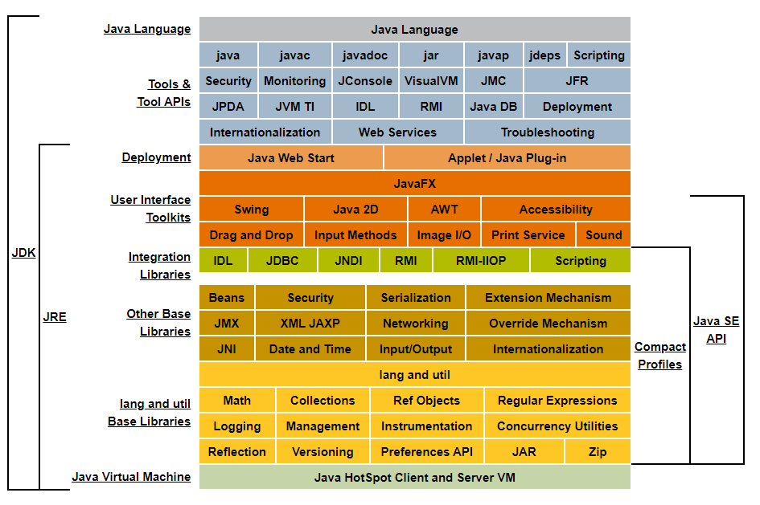
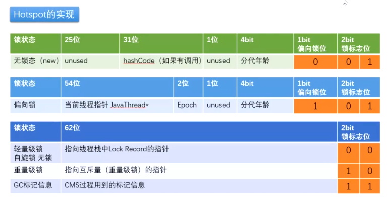

#### Java语言技术栈



#### 一：java内存模型

JVM规范，内存共分为虚拟机栈、堆、方法区、程序计数器、本地方法栈五个部分。


程序计数器：

​	是一块较小的内存空间，可以看作当前线程所执行的字节码的行号指示器。在虚拟机的概念模型里，字节码解释器工作时就是通过改变这个计数器的值来选择下一条需要执行的字节码指令，分支、跳转、循环、异常处理、线程恢复等基础功能都需要依赖这个计数器来完成。

​	java虚拟机的多线程是通过轮流切换并分配处理器执行时间的方式来实现的。在一个确定的时刻，一个处理器只能处理一个线程的一条指令。因此，在线程切换时，需要保存各自线程已经运行到的指令位置。也即程序计数器为【线程私有】。

​    当先线程正在执行一个java方法时，该计数器记录的是正在执行的虚拟机字节码执行的地址。如果是Native方法，则该值为【Undefined】。该区域是唯一一个没有任何OutOfMemoryError情况的区域。

java虚拟机栈：

​	线程私有，生命周期与线程相同。它用来描述java方法执行的内存模型。每个方法执行的同时，都会创建一个栈帧【Stack Frame】用于存储调该方法的局部变量表、操作数栈、动态链接、方法出口等信息。每一个方法的调用到执行，都对应着一个栈帧在虚拟机中入栈到出栈的过程。

​    如果线程请求的栈深度大于虚拟机所允许的深度，将抛出StackOverflowError 异常。如果虚拟机栈可以动态扩展（当前大部分的java虚拟机都可以动态扩展，只不过java虚拟机规范中也允许固定长度的虚拟机栈），扩展时无法申请到足够的内存，就会抛出OutOfMemoryError异常。

本地方法栈：

​	与虚拟机栈作用相似，区别在于虚拟机栈为执行java方法服务，本地方法栈为Native方法服务。虚拟机规范并没有强制规定如何实现。甚至Sun HotSpot虚拟机把虚拟机栈与本地方法栈合二为一。同样，本地方法栈也会抛出StackOverflowError 和OutOfMemoryError异常。

Java堆：

​	虚拟机管理的内存中最大的一块。Java堆被所有线程共享，在虚拟机启动时创建。Java堆的唯一目的就是存放对象实例，几乎所有的对象实例都在这里分配内存。但随着JIT编译器的发展与逃逸分析技术逐渐成熟，栈上分配、标量替换优化技术将会导致一些微妙的变化发生，所有对象都在对上分配也渐渐变得不是那么“绝对”了。

​	Java堆是垃圾收集器管理的主要区域，因此也被称作“GC堆”。由于现在收集器基本都是采用分代收集算法，所以Java堆还可以细分为：新生代和老年代；再细致一点的有Eden空间、From Survivor空间、To Survivor空间等。从内存分配角度来看，又可以划分出多个 【线程私有的分配缓冲区】（Thread Local Allocation Buffer, TLAB）。

​	Java虚拟机规范规定，Java堆可以处于物理上不连续的内存空间中，只要逻辑上连续即可。在实现时，既可以实现成固定大小的，也可以是可扩展的，不过当前主流的虚拟机都是按照可扩展来实现的。如果在堆中没有内存完成实例分配，并且堆也无法再扩展时，将会抛出OutOfMemoryError异常。

方法区：

​	方法区与Java堆一样，是各线程共享的内存区域，它用于存储已被虚拟机加载的类信息、常量、静态变量、即时编译器编译后的代码等数据。虽然Java虚拟机规范把方法区描述为堆的一个逻辑部分，但是它却有一个别名叫做Non-Heap（非堆），目的应该是与Java堆区分开来。

​	在HotSpot虚拟机实现中，方法区用永久代来实现。目的是能够把分代收集扩展至方法区，这样HotSpot垃圾收集器可以像管理Java堆一样管理该区域。其他虚拟机实现中没有永久代的概念。现在看来，用永久代实现方法区并不是一个好主意，因为这样更容易遇到内存溢出问题，而且有极少数方法（例如String.intern()）会因这个原因导致不同的虚拟机下有不同的表现。在JDK 1.7 中，已经把原本放在永久代的字符串常量池移除。在JDK 1.8中，已经完全移除了永久代的概念。

​	Java虚拟机规范中，对方法区的限制非常宽松，除了可以不需要连续的内存和可以选择固定大小或者可扩展外，还可以选择不实现垃圾收集。相对的，垃圾收集在该区域下是比较少见的，但并非数据进入方法区之后就能够“永久”存在了。该区域的内存回收目标主要针对常量池的回收和对类型的卸载，一般来说，该区域的回收“成绩”比较令人满意，尤其是类型的卸载，条件相当苛刻，但是该区域的回收确实是必要的。

​	Java虚拟机规范的规定，当方法区无法免租内存分配需求时，将抛出OutOfMemoryError异常。

运行时常量池：

​	运行时常量池（Runtime Constant Pool）是方法区的一部分。Class文件中除了有类的版本、字段、方法、接口等描述信息外，还有一项信息是常量池表（Constant Pool Table）,用于存放编译器生成的各种字面量和符号引用，这部分内容将在类加载后进入方法区的运行时常量池中存放。也包括直接引用。

​	运行时常量池相对于Class文件的常量池表的另外一个重要特征是具备动态性，java语言并不要求常量一定只有编译期才能产生，也就是并非预植入Class文件中常量池表的内容才能进入方法区的运行时常量池，运行期也可能将新的常量放入池中，这种特性被开发人员利用得比较多的便是String类的intern()方法。

​	当常量池无法申请到内存时会抛出OutOfMemoryError异常。

直接内存：

​	直接内存（Direct Memory）并不是虚拟机运行时数据区的一部分，也不是Java虚拟机规范中定义的内存区域。但也经常被使用，也有可能导致OOM。

​	在NIO类，基于通道（Channel）与缓冲区（Buffer）的I/O方式，使用了Native函数库直接分配堆外内存，然后通过一个存储在Java堆中的DirectByteBuffer对象作为这块内存的引用进行操作。

​	虽然直接内存不受Java堆的限制，但是还是会受本机总内存大小以及处理器寻址空间的限制。

#### 二：HotSpot虚拟机对象

Java堆上的对象是如何进行创建、布局、访问的？

创建：

 1. 判断该类是否已加载？

    如果未加载，则先执行相应的类加载过程

 2. 分配内存

    ​	如果内存是规整的，则使用“指针碰撞”（Bump the Pointer）的方式，分配内存空间。

    如果内存不是规整的，则使用“空闲列表”（Free List）的方式，分配内存空间。

    内存是否规整，跟垃圾收集器有关。如Serial、ParNew等收集器采用“指针碰撞”的方式，而CMS通常采用空间列表方式。

    ​	保证并发安全：1. CAS 2. TLAB（默认开启）

    ​	设置零值

 3. 设置对象头

    ​	设置类型元信息、对象的哈希码、对象的GC分代年龄等

 4. 对象初始化

对象布局：

​	对象在内存中分为3个区域：对象头（Header）、实例数据（Instance Data）、对齐填充（Padding）.

​	对象头：

​		运行时数据（Mark Word）：

​			记录哈希码、GC分代年龄、锁状态标志、lock Record、偏向线程ID、偏向时间戳等信息，数据长度32位和64位虚拟机上分别为32bit和64bit（未开启压缩指针）。

​	

​		类型指针（Class Pointer）：

​			指向对象的类元数据的指针，来确定该对象属于哪个类型。但并不是所有的虚拟机实现都必须保留类型指针。

​		数组长度（当对象类型为数组时）：

​			普通Java对象实例可以通过对象的元数据信息确定对象大小，但数组并不能确定数组的大小。所以需要单独维护长度大小。

​	实例数据：

​		记录该对象的字段（包含父类）。字段的存储顺序受虚拟机分配策略参数（FieldsAllocationStyle）和字段在Java源码中定义的顺序影响。

​		默认的分配策略为：longs/doubles、ints、shorts/chars、bytes/booleans、oops（Ordinary Object Pointers）。

​		在默认分配策略下，相同宽度的字段被分配到一起，在满足该前提条件下，父类字段会出现在子类之前。如果CompactFields参数值为true，那么子类中较窄的字段有可能插入到父类字段的空隙之中。

​	对齐填充：

​		虚拟机的自动内存管理系统要求对象起始地址必须是8字节的整数倍，对象头是8字节的倍数，就要求在实例数据不够8字节的整倍数	时，需要填充字节。

​		以HashMap中的Node类为例：

```java
// HashMap
static final class TreeNode<K,V> extends LinkedHashMap.Entry<K,V> {
        TreeNode<K,V> parent;  // red-black tree links
        TreeNode<K,V> left;
        TreeNode<K,V> right;
        TreeNode<K,V> prev;    // needed to unlink next upon deletion
        boolean red;
}
// LinkedHashMap
static class Entry<K,V> extends HashMap.Node<K,V> {
    Entry<K,V> before, after;
    Entry(int hash, K key, V value, Node<K,V> next) {
        super(hash, key, value, next);
    }
}
// HashMap
static class Node<K,V> implements Map.Entry<K,V> {
    final int hash;
    final K key;
    V value;
    Node<K,V> next;
}

```

```console
java.util.HashMap.TreeNode object internals:
 OFFSET  SIZE             TYPE DESCRIPTION                               VALUE
      0    12                  (object header)                           N/A
     12     4              int Node.hash                                 N/A
     16     4                K Node.key                                  N/A
     20     4                V Node.value                                N/A
     24     4       Node<K, V> Node.next                                 N/A
     28     4      Entry<K, V> Entry.before                              N/A
     32     4      Entry<K, V> Entry.after                               N/A
     36     1          boolean TreeNode.red                              N/A
     37     3                  (alignment/padding gap)                  
     40     4   TreeNode<K, V> TreeNode.parent                           N/A
     44     4   TreeNode<K, V> TreeNode.left                             N/A
     48     4   TreeNode<K, V> TreeNode.right                            N/A
     52     4   TreeNode<K, V> TreeNode.prev                             N/A
Instance size: 56 bytes
Space losses: 3 bytes internal + 0 bytes external = 3 bytes total

```

对象访问：

​	对象访问通过栈上的reference来操作堆上的对象。

​	reference的实现方案有两种：句柄方式和直接指针两种。

​	句柄：内存中划分出一块内存作为句柄池。reference中存储的是对象的句柄地址。句柄中包含对象实例数据和对象类型数据各自的具体地址信息。优点：对象移动后，不需要改变reference。

​	直接指针：reference中存储的是对象的实际地址。对象实例的对象头中存储着对象类型数据的地址。优点：访问速度快。（HotSpot实现）

#### 三：垃圾收集算法与收集器

​	**垃圾收集算法：**

​	哪些内存需要回收？换句话说，哪些对象是可以被回收的？

​	判断一个对象是否存活，有两种算法：

   - **引用计数算法**

     给对象添加一个引用计数器，每当有一个地方引用它时，就加1；当引用失效时，就减1。

     但会产生循环引用问题。

   - **可达性分析算法**

     从“Root GC”对象开始，向下搜索所有对象，如果一个对象没有与根节点相连，则证明该对象不可用。也就被判定为可回收的对象。

     Root GC：

      - 虚拟机栈中引用的对象
      - 方法区中类静态属性引用的对象
      - 方法区中常量引用的对象
      - 本地方法栈中JNI（Native方法）引用的对象

     **引用类型**：

     ​	在JDK1.2以前，引用的定义：如果reference类型的数据中存储的数值代表的是另外一块内存的起始地址，就称这块内存代表着一个引用。这样的定义让一个引用只有两个状态：被引用和没有被引用。如果想表达一个对象可有可无的状态，就无能为力了。

     ​	在JDK1.2之后，对引用进行了扩充，分为4种：强引用、软引用、弱引用、虚引用。

      - 强引用（Strong Reference）

        ​	强引用到处存在，类似“Object obj = new Object()”这类的引用，只要强引用存在，对象就永远不会被垃圾收集器回收。

      - 软引用（Soft Reference）

        ​	软引用用来描述一些还有用但并非必要的对象。在系统将要发生内存溢出异常之前，将会把这些对象列进回收范围之中进行第二次回收。如果这次回收还没有足够的内存，才会抛出内存溢出异常。

      - 弱引用（Weak Reference）

        弱引用来描述非必要对象的。它比软引用更弱一些。被软引用关联的对象只能生存到下次垃圾收集之前。当垃圾收集器工作时，无论内存是否足够，都会回收掉被弱引用关联的对象。

      - 虚引用（Phantom Reference）

        ​	最弱的引用，一个对象是否有虚引用的存在，完全不会对其生存时间构成影响，也无法通过虚引用来取得一个对象实例。为一个对象设置虚引用的唯一目的就是能在这个对象被收集器回收时收到一个系统通知。

     **finalize()方法**：

     ​	当一个对象不可达时，也并不是说该对象就是一定要回收的。当该对象不可达时，会被第一次标记，并进行一次筛选，筛选条件是是否有必要执行finalize()方法。当对象没有覆盖finalize()方法，或者finalize()方法已经被虚拟机调用过，虚拟机将这两种情况都视为“没有必要执行”。

     ​	当这个对象被判定为有必要执行finalize()方法，那么这个对象将放置到一个叫做F-Queue的队列中，并在稍后有一个由虚拟机自动建立的、低优先级的Finalizer线程去执行它。这里的执行是指虚拟机会触发这个方法，但并不承诺会等待它运行结束，原因是：如果一个对象在finalize()方法中执行缓慢，或者发生了死循环，将很可能导致F-Queue队列中其他对象永久处于等待，甚至导致整个内存回收系统崩溃。稍后，会对队列中的对象进行第二次标记，那些已经重新关联跟对象的对象会被移出队列。如果对象在第二次标记后依然不可达，基本被认为被回收了。

     **回收方法区**

     新生代的回收效率一般为70% ~ 95%，而方法区的回收效率要低很多。

     方法区中的常量池，回收字面量很简单，如果没有任何引用引用该常量，当发生内存回收时，如果有必要，该常量就会被系统清理出常量池。常量池中的类、接口、方法、字段的符号引用也类似。

     一个类是否可以被回收，条件是相对苛刻许多。要同时满足如下三个条件：

     - 该类所有实例都已经被回收
     - 加载该类的类加载器已经被回收
     - 该类的类对象没有在任何地方被引用，无法在任何地方通过反射访问该类的方法。

     当同时满足了上述三条条件，也只能说“可以”，而不会说和对象一样，不使用了就必然会回收。可以使用-Xnoclassgc禁止类型回收。使用-verbose:class 以及-XX:TraceClassLoading、-XX:TraceClassUnLoading查看类加载与卸载信息。

     在大量使用反射、动态代理、CGLib等ByteCode框架，动态生成JSP以及OSGi这类频繁自定义ClassLoader的场景都需要虚拟机具备卸载类的功能。

     **垃圾收集算法**

      - 标记-清除算法（Mark-Sweep）

        ​	分为标记和清除两个阶段：首先标记出需要回收的对象，在标记完成后统一回收所有被标记的对象。标记过程在介绍finalize()方法时已经介绍过了。该算法是最基础的算法，之后的算法也都是针对该算法的不足并行改进的。主要不足有两点：一个是效率问题，两个过程效率都不高；另一个是空间问题，标记清除后会产生大量不连续的内存碎片，空间碎片太多可能会导致以后在程序运行中需要分配较大对象是，无法找到足够的连续内存而不得不提前触发另一次垃圾收集动作。

      - 复制算法（Copying）

        ​	将内存按容量划分为大小相等的两块，每次只是用一块，当一块用完了，就把存活的对象复制到另一块内存上，然后把已用过的内存空间一次清理掉。对象创建时分配空间，直接移动指针，顺序分配即可。

        ​	该算法主要应用于新生代的垃圾回收，新生代的对象98%是“朝生夕死”的。而是将内存分为一块较大的Eden空间和两块较小的Survivor空间，每次只是用Eden空间和其中一块Survivor空间，当回收时，将Eden和Survivor存活的对象一次性地复制到另一块Survivor区，最后清理掉刚使用过的Eden和Survivor。HotSpot虚拟机默认Eden ：Sruvivor=8 ：1，也就意味着系统默认新生代的可利用的内存占比为：90%。每次回收时，我们不能保证只有少于10%的对象存活，因此需要依赖其他内存（老年代）进行分配担保（Handle Promotion）。

      - 标记-整理算法（Mark-Compact）

        ​	对标记后存活的对象向一段移动，然后清理掉边界以外的内存。

      - 分代收集算法（Generational Collection）

        ​	根据对象存货周期的不同将内存划分为几块。再根据各内存区域的特点采用适当的收集算法。一般把Java堆分为新生代和老年代。新生代采用【复制算法】，老年代采用【标记-清理】或者【标记-整理】算法进行回收。

     **HotSpot的算法实现**

     ​	枚举根节点：

     ​		根节点存在于全局性的引用以及执行上下文（栈帧中的本地变量表）中，有的应用仅仅是方法区都有数百兆。另外，在GC停顿上更要求可达性分析过程不能太长时间。因为要保证分析结果的一致性，必须在分析过程中不能让对象关系还在变化。GC进行时，必须停顿所有Java执行线程（Stop The World）。

     ​		当前主流的Java虚拟机使用的都是准确式GC（虚拟机要能判断一个引用（32bit的整数）到底是引用还是整数，准确式虚拟机采用句柄方式维护引用的稳定性）。HotSpot的实现中，采用一组称为OopMap的数据结构来维护引用，在类加载完成后，虚拟机把对象内什么偏移量上是什么类型的数据计算出来，在JIT编译过程中，也会在特定的位置记录下栈和寄存器中哪些位置是引用。

     ​	安全点：

     ​		为每条指令生成OopMap是不现实的。HotSpot只会在‘特定位置’记录这些信息，这个“特定位置”称为安全点（Safepoint）,即程序执行时并非在所有地方都能停顿下来开始GC，只有在到达安全点时才能暂停。安全点的选定既不能太少以致于让GC等待时间太长，也不能过于频繁以致于过分增大运行时的负载。原则是：是否具有让程序长时间执行的特征。“长时间执行”是指指令序列复用，例如方法调用、循环跳转、异常跳转等。

     ​		另一个问题，如何在GC发生时，让所有线程（不包含执行JIT调用的线程）到跑到最近的安全点再停顿下来。两种方案：抢先式中断（Preemptive Suspension）和主动式中断（Voluntary Suspension）。抢先式中断是把所有线程全部中断，如果有不在安全点上的线程，就恢复线程。几乎没有虚拟机实现该方案。主动式中断是在GC发生时，只设置一个标志，各线程主动的轮询这个标志，标志为真时，线程中断挂起。

     ​	安全区域：

     ​		正在执行的线程能够主动轮询标志，中断挂起。那如果是休眠状态或者阻塞状态的线程，怎么响应JVM的中断请求呢？采用安全区域（Safe Region）来解决。安全区域是指在一段代码中，引用关系不会发生变化的区域。该区域的任意地方都是可以安全开始GC的。

     ​		在线程执行到安全区域时，首先标识自己已经进入安全区域，当在这段时间里发生GC,不用管是处于安全区域的线程，它继续执行，当该线程要离开安全区域时，它要检查系统是否已经完成了根节点枚举（或整个GC过程），如果完成，则继续执行，否则，它必须等待直到收到可以离开安全区域的信号为止。

     **垃圾收集器：**

     ​	Serial 收集器：

     ​		单线程新生代复制算法收集器，在进行垃圾收集时，会停掉其他所有线程，直到收集结束。看似鸡肋的收集器，但它仍是虚拟机运行在Client模式下的默认新生代收集器。它简单而高效（与其他收集器的单线程相比）。它是单CPU环境下，拥有很高的收集效率。在桌面应用场景中，是一个很好的选择。

     ​	ParNew 收集器：

     ​		多线程版本的Serial收集器。运行在Service模式下的默认新生代并行垃圾收集器。除了Serial收集器以外，它是能与CMS收集器相配合的唯一收集器。

     注意：

     ​	并行（Parallel）：指多条垃圾收集线程并行工作，但此时用户线程仍然处于等待状态。

     ​	并发（Concurrent）：值用户线程与垃圾收集线程同时执行（但不一定是并行的，可能会交替执行），用户程序在继续执行，而垃圾收集程序运行于另一个CPU上。

     ​	Parallel Scavenge 收集器：

     ​		采用复制算法，运行在新生代的并行的多线程收集器，关注点在于吞吐量（Throughput）。吞吐量 = 运行用户代码时间  / （运行用户代码时间 + 垃圾收集时间）。
     
     ​		高吞吐量可以高效率利用CPU时间，尽快完成程序的运算任务，主要适合在后台运算而不需要太多交互的任务。低停顿时间适合需要与用户交互的程序，良好的响应速度能提升用户体验。
     
     ​		相关参数：
     
     ​			-XX:MaxGCPauseMillis：最大垃圾收集时间。大于0的值。设置过小不会使系统的垃圾收集速度变得更快，GC停顿时间缩短是以牺牲吞吐量和新生代空间来换取的。
     
     ​			-XX:GCTimeRotio：设置吞吐量的大小。大于0小于100的整数。若该值为19，则表示垃圾收集耗时为1，用户运行时间为19，吞吐量为19/（1+19）= 95%。
     
     ​			-XX:+UseAdaptiveSizePolicy：开启GC自适应调节策略。这也是该收集器与Parnew收集器的一个重要区别。
     
     ​	Serial Old 收集器：
     
     ​		Serial收集器的老年代版本，也是单线程收集器。从用【标记-整理】算法。主要是给Client模式下的虚拟机使用。在Server模式下，一是在JDK1.5及以前版本中与Parallel Scavenge收集器搭配使用（Parallel Scavenge收集器架构中本身有PS MarkSweep收集器来进行老年代收集，但功能与Serial Old相似）；二是作为CMS收集器的后备方案，在并发收集发生Concurrent Mode Failure时使用。
     
     ​	Parallel Old 收集器：
     
     ​		Parallel Scavenge的老年代版本，使用多线程和【标记-整理】算法。在JDK1.6中开始提供。在此之前，新生代的Parallel Scavenge一直没有一个“好队友”与之配合工作。老年代的收集工作老是拖后腿。
     
     ​		有了Parallel Old收集器搭配，在高吞吐量已经CPU资源敏感场景中，是一个非常好的选择。
     
     ​	CMS 收集器：
     
     ​		以最短回收停顿时间为目标的收集器。非常适合互联网站或者B/S系统的服务端上，响应快，低停顿。CMS收集器基于【标记-清除】算法，运作过程分为：
     
      - 初始标记（CMS initial mark）
     
        STW，标记根对象能关联的对象，速度快
     
      - 并发标记（CMS concurrent mark）
     
        进行GC Roots Tracing
     
      - 重新标记（CMS remark）
     
        修正并发标记期间标记变动的那一部分对象的标记记录，STW，停顿时间一般比初始标记阶段稍长一些，但远比并发标记时间短。
     
      - 并发清除（CMS concurrent sweep）
     
        与用户线程并发执行，清除垃圾对象
     
        ----------------------------
     
        优点：并发，低停顿
     
        缺点：
     
        - CPU资源敏感。CMS默认启动的回收线程数是（CPU数量 + 3）/ 4，当CPU数量为2时，垃圾收集线程就占了一半，大大影响程序运行效率。
        - CMS收集器无法处理浮动垃圾（Floaing Garbage），可能出现“Concurrent Mode Failure”失败而导致另一次Full GC的产生。浮动垃圾：由于CMS并发清除阶段用户线程还在运行，伴随程序运行自然就会有新的垃圾产生，这一部分垃圾出现在标记过程之后，CMS无法在当次收集中处理掉它们，只好留在下一次GC时再清理掉。这部分垃圾就是浮动垃圾。又由于垃圾收集阶段用户线程还在运行，也就需要预留有足够的内存空间给用户线程使用，因此CMS收集器不能像其他收集器那样等到老年代几乎完全被填满了再进行收集，需要预留一部分空间提供并发收集时的程序运作使用。适当调高参数-XX:CMSInitiatingOccupancyFraction的值来提高出发百分比，以便降低内存回收次数从而获取更好的性能。要是CMS运行期间预留的内存无法满足程序需要，就会出现一次“Concurrent Mode Failure”失败，这时虚拟机将启动后备预案：临时启用Serial Old收集器来重新进行老年代的垃圾收集，这样停顿时间更长了。所以-XX:CMSInitiatingOccupancyFraction参数设置太高很容易导致大量“Concurrent Mode Failure”失败，降低性能。
        - 产生大量内存碎片。空间碎片过多时，在分配大对象时找不到足够大的空间，不得不提前触发一次Full GC。参数-XX:+UseCMSCompactAtFullCollection（默认开启），用于在CMS收集器顶不住要进行FullGC时开启内存碎片的合并整理过程，该过程是无法并发的，空间碎片问题解决了，但停顿时间不得不变长。-XX:CMSFullGCsBeforeCompaction用于设置执行多少次不压缩的Full GC后，跟着来一次带压缩的（默认0，表示每次进入Full GC时都进行碎片整理）。
     
     ​	G1 收集器：
     
     ​		面向服务端的收集器。
     
     ​		特点：
     
        - 并行与并发
     
          充分利用多核CPU，缩短STW时间
     
        - 分代收集
     
          保留分代思想，不需要其他收集器配合。
     
        - 空间整合
     
          从整体来看是基于【标记-整理】算法，局部来看是基于【复制】算法。运行期间不会产生内存碎片，分配大对象不会因为无法找到连续的内存空间而提前触发一次GC。
     
        - 可预测的停顿
     
          除了低停顿外，还能建立可预测的停顿时间模型，能让使用者明确指定在一个长度为M毫秒的时间片段内，消耗在垃圾收集上的时间不得超过N毫秒，几乎做到实时Java的垃圾收集器的特征了。
     
          ------------
     
          G1将整个Java堆划分为多个大小相等的独立区域（Region），虽然还保留有新生代和老年代的概念，但新生代与老年代不再是物理隔离的了。它们都是一部分Region（不需要连续）的集合。
     
          G1的可预测的停顿是基于它有计划的避免在整个堆中进行全区域的垃圾收集。G1跟踪各个Region里面的垃圾堆积的价值大小，在后台维护一个优先列表，每次根据允许的收集时间，优先回收价值最大的Region。
     
          分区域的思路看似简单，其实不然。G1从实验到商用，用了近10年。G1的垃圾收集过程做不到以Region为单位进行收集。因为一个对象分配到某个Region中，它并非只能被本Region中的其他对象引用。在可达性分析中，岂不是要扫描全表来保证准确性？
     
          在G1中，每个Region都对应着一个Remembered Set，虚拟机发现程序在对Reference类型的数据进行写操作时，会产生一个Write Barrier暂时中断写操作，检查Reference引用的对象是否处于不同的Region之中（在分代的例子中，就是检查是否老年代中的对象引用了新生代中的对象），如果是，便通过CardTable把相关引用信息记录到被引用对象所属的Region的Remembered Set之中。当进行内存回收时，在GC根节点的枚举范围中加入Remembered Set即可保证不对全堆扫描也不会有遗漏。
     
          G1收集器的运作过程：
     
           - 初始标记（Initial Marking）
     
             标记一下被GC Roots关联的对象，并修改TAMS（Next Top at Mark Start）的值，让下一阶段用户程序并发运行时，能在正确可用的Region中创建新对象，该阶段需要停顿，但耗时很短。
     
           - 并发标记（Concurrent Marking）
     
             从GC Roots 开始，进行可达性分析，耗时较长，与用户线程并发执行。
     
           - 最终标记（Final Marking）
     
             修正在并发标记阶段因用户线程继续运行而导致标记产生变动的那一部分标记记录，虚拟机将这阶段的变化记录在线程Remembered Set Logs里面，最终标记阶段需要把Remembered Set Logs的数据合并到Remembered Set中，这阶段需要停顿，但可并行执行。
     
           - 筛选回收（Live Data Counting and Evacuation）
     
             首先对各个Region的回收价值排序，根据用户设置的期望指定计划。
     
     收集器相关链接：https://blogs.oracle.com/jonthecollector/our-collectors
     
     ​	GC日志：
     
     ```console
     33.125: [GC [DefNew: 3324k->152k(3712k), 0.0025925 secs] 3324k->152k(11904k), 0.0031680 secs]
     100.667: [Full GC [Tenured: 0k->210k(10240k), 0.0149142 secs] 4603k->210k(19456k), [Perm : 2999k->2999k(21248k)], 0.0150007 secs] [Times: user=0.01 sys=0.00 real=0.02 secs]
     ```
     
     ​	最前面的数字：33.125 和 100.667代表GC发生的时间，该数值是从Java虚拟机启动以来经过的秒数。
     
     ​	GC日志开头的 [GC 和 [Full GC说明这次收集的停顿类型，而不是用来区分新生代GC还是老年代GC的。如果有“Full",说明这次GC是发生了STW的。
     
     ​	[DefNew [Tenured [Perm 表示发生的区域，这里显示的区域名称与使用的GC收集器密切相关。例如：Serial收集器中的新生代名为Default New Generation 则日志显示为 [DefNew；如果是ParNew收集器，新生代名称为Parallel New Generation 日志显示为[ParNew；如果是Parallel Scavenge收集器，日志显示为PSYoungGen。
     
     ​	3324k->152k(3712k) 表示：GC前该内存区域已使用容量->GC后该区域已使用容量(该内存区域总容量)。
     
     ​	方括号外3324k->152k(11904k)表示：GC前Java堆已使用容量->GC后Java堆已使用容量(Java堆总容量)。
     
     ​	0.0025925 secs 表示：GC所占用的时间（秒）
     
     ​	[Times: user=0.01 sys=0.00 real=0.02 secs] 表示：用户态消耗的CPU时间、内核态消耗的CPU时间、操作从开始到结束所经过的墙钟时间（Wall Clock Time）。墙钟时间包括非运算时间，如等待磁盘IO、线程阻塞，而CPU时间不包括这些。在多核或者多CPU情况下，多线程会叠加这些CPU时间，所以user,sys时间超过real属于正常。
     
     Java参数：
     
     - ##### 标准参数
     
     ```console
     java -help
     	java [-options] class [args...]
                (执行类)
     或  java [-options] -jar jarfile [args...]
                (执行 jar 文件)
     其中选项包括:
         -d32          使用 32 位数据模型 (如果可用)
         -d64          使用 64 位数据模型 (如果可用)
         -server       选择 "server" VM
                       默认 VM 是 server.
     
         -cp <目录和 zip/jar 文件的类搜索路径>
         -classpath <目录和 zip/jar 文件的类搜索路径>
                       用 ; 分隔的目录, JAR 档案
                       和 ZIP 档案列表, 用于搜索类文件。
         -D<名称>=<值>
                       设置系统属性
         -verbose:[class|gc|jni]
                       启用详细输出
         -version      输出产品版本并退出
         -version:<值>
                       警告: 此功能已过时, 将在
                       未来发行版中删除。
                       需要指定的版本才能运行
         -showversion  输出产品版本并继续
         -jre-restrict-search | -no-jre-restrict-search
                       警告: 此功能已过时, 将在
                       未来发行版中删除。
                       在版本搜索中包括/排除用户专用 JRE
         -? -help      输出此帮助消息
         -X            输出非标准选项的帮助
         -ea[:<packagename>...|:<classname>]
         -enableassertions[:<packagename>...|:<classname>]
                       按指定的粒度启用断言
         -da[:<packagename>...|:<classname>]
         -disableassertions[:<packagename>...|:<classname>]
                       禁用具有指定粒度的断言
         -esa | -enablesystemassertions
                       启用系统断言
         -dsa | -disablesystemassertions
                       禁用系统断言
         -agentlib:<libname>[=<选项>]
                       加载本机代理库 <libname>, 例如 -agentlib:hprof
                       另请参阅 -agentlib:jdwp=help 和 -agentlib:hprof=help
         -agentpath:<pathname>[=<选项>]
                       按完整路径名加载本机代理库
         -javaagent:<jarpath>[=<选项>]
                       加载 Java 编程语言代理, 请参阅 java.lang.instrument
         -splash:<imagepath>
                       使用指定的图像显示启动屏幕
     ```
     
     - ##### X参数：非标准参数
     
     ```
     java -X
     -Xmixed           混合模式执行 (默认)
     -Xint             仅解释模式执行
     -Xbootclasspath:<用 ; 分隔的目录和 zip/jar 文件>
                       设置搜索路径以引导类和资源
     -Xbootclasspath/a:<用 ; 分隔的目录和 zip/jar 文件>
                       附加在引导类路径末尾
     -Xbootclasspath/p:<用 ; 分隔的目录和 zip/jar 文件>
                       置于引导类路径之前
     -Xdiag            显示附加诊断消息
     -Xnoclassgc       禁用类垃圾收集
     -Xincgc           启用增量垃圾收集
     -Xloggc:<file>    将 GC 状态记录在文件中 (带时间戳)
     -Xbatch           禁用后台编译
     -Xms<size>        设置初始 Java 堆大小
     -Xmx<size>        设置最大 Java 堆大小
     -Xss<size>        设置 Java 线程堆栈大小
     -Xprof            输出 cpu 配置文件数据
     -Xfuture          启用最严格的检查, 预期将来的默认值
     -Xrs              减少 Java/VM 对操作系统信号的使用 (请参阅文档)
     -Xcheck:jni       对 JNI 函数执行其他检查
     -Xshare:off       不尝试使用共享类数据
     -Xshare:auto      在可能的情况下使用共享类数据 (默认)
     -Xshare:on        要求使用共享类数据, 否则将失败。
     -XshowSettings    显示所有设置并继续
     -XshowSettings:all
                       显示所有设置并继续
     -XshowSettings:vm 显示所有与 vm 相关的设置并继续
     -XshowSettings:properties
                       显示所有属性设置并继续
     -XshowSettings:locale
                       显示所有与区域设置相关的设置并继续
     ```
     
     - ##### XX参数：
     
     ```console
     # 查看工程学选择的JVM参数以及堆空间大小和选定的垃圾收集器。
     D:\IdeaProjects\my01>java -XX:+PrintCommandLineFlags -version
     -XX:InitialHeapSize=258687808 -XX:MaxHeapSize=4139004928 -XX:+PrintCommandLineFlags -XX:+UseCompressedClassPointers -XX:+UseCompressedOops -XX:-UseLargePagesIndividualAllocation -XX:+U
     seParallelGC
     java version "1.8.0_251"
     Java(TM) SE Runtime Environment (build 1.8.0_251-b08)
     Java HotSpot(TM) 64-Bit Server VM (build 25.251-b08, mixed mode)
     
     # 查看XX参数默认值
     D:\IdeaProjects\my01>java -XX:+PrintFlagsInitial -version
     [Global flags]
          intx ActiveProcessorCount                      = -1                                  {product}
         uintx AdaptiveSizeDecrementScaleFactor          = 4                                   {product}
         uintx AdaptiveSizeMajorGCDecayTimeScale         = 10                                  {product}
         uintx AdaptiveSizePausePolicy                   = 0                                   {product}
     ...
     
     ```
     
     - 查看运行时生效的XX参数
     
     ```console
     # 查看XX参数运行程序时生效的值
     D:\IdeaProjects\my01>java -XX:+PrintFlagsFinal -version
     [Global flags]
          intx ActiveProcessorCount                      = -1                                  {product}
         uintx AdaptiveSizeDecrementScaleFactor          = 4                                   {product}
         uintx AdaptiveSizeMajorGCDecayTimeScale         = 10                                  {product}
         uintx AdaptiveSizePausePolicy                   = 0                                   {product}
         uintx AdaptiveSizePolicyCollectionCostMargin    = 50                                  {product}
      ...
     
     
     ```
     
     
     
     > ​	其中：-XX:+UseParallelGC 表示使用parallel scavenge GC进行垃圾回收，并且自动开启-XX:+UseParallelOldGC参数使用ParallelOldGC
     
     

详细参数请参考：	

​	Unix: https://docs.oracle.com/javase/8/docs/technotes/tools/unix/java.html

​	Windows: https://docs.oracle.com/javase/8/docs/technotes/tools/windows/java.html

常用参数设置：

默认情况下，java8自动开启的垃圾收集器为：parallel scavenge GC + PS MarkSweep（实现完全与Serial Old GC 一样）（以吞吐量为目标）

​	使用CMS垃圾收集器：-XX:+UseConcMarkSweepGC （ParNewGC 自动开启）（以低延迟为目标）

| 参数                                | Yong区垃圾收集器    | Old区垃圾收集器     | 描述                                                         |
| ----------------------------------- | ------------------- | ------------------- | ------------------------------------------------------------ |
| -XX:+UseParallelGC                  | PS Scavenge         | PS MarkSweep        | 以吞吐量为目标的收集方案                                     |
| -XX:+UseConcMarkSweepGC             | ParNew              | ConcurrentMarkSweep | 以低延迟为目标的收集方案                                     |
| -XX:+UseParNewGC                    | ParNew              | MarkSweepCompack    |                                                              |
| -XX:+UseSerialGC                    | Copy                | MarkSweepCompack    |                                                              |
| -XX:+UseParallelOldGC               | PS Scavenge         | PS MarkSweep        |                                                              |
| -XX:+UseG1GC                        | G1 Young Generation | G1 Old Generation   |                                                              |
| -XX:+PrintGCDetails                 |                     |                     | 打印GC日志。                                                 |
| -XX:PretenureSizeThreshold          |                     |                     | 设置大对象阈值（单位：字节）                                 |
| -XX:SurvivorRatio                   |                     |                     | 设置eden / survivor 比值，默认：8                            |
| -XX:PretenureSizeThreshold          |                     |                     |                                                              |
| -xx:MaxTenuringThreshold            |                     |                     | 晋升到老年代的对象年龄，默认：CMS为6，PS Scavenge为15。      |
| -XX:ParallelGCThreads               |                     |                     | 设置并行垃圾回收的线程数                                     |
| -XX:MaxGCPauseMillis                |                     |                     | 设置GC的最大（努力）停顿时间。只对Parallel Scavenge收集器有效 |
| -XX:CMSTriggerRatio                 |                     |                     | 设置触发CMS垃圾回收的内存占比。默认：80                      |
| -XX：CMSInitiatingOccupancyFraction |                     |                     | 设置触发CMS垃圾回收的内存占比。默认：-1，如果该值为负数，则使用-XX:CMSTriggerRatio设置的值。 |
| -XX:PretenureSizeThreshold          |                     |                     | 设置大对象阈值。大于该阈值的对象将直接在老年代分配。该参数只有Serial和Parallel Scavenge收集器有效。 |


#### 四：内存分配与回收策略

​	内存分配：在堆上分配（但也可能经过JIT编译后被拆散为标量类型并间接在栈上分配），对象主要分配在新生代的Eden区上，如果启动了本地线程分配缓冲，将按线程优先在TLAB上分配。少数情况下也可能直接在老年代分配，分配规则不是固定的，受垃圾收集器及虚拟机与内存参数设置。

  - 对象优先在Eden区分配

    如果Eden区没足够的空间分配内存，将引发一次Minor GC。在GC过程中，如果Eden区存活的对象复制到Survivor区时，Survivor区的内存不够，会将存活的对象分配到老年代中去。此时，Eden区空间占用率为0，新对象可以被分配足够的内存。

  - 大对象直接进入老年代

    ​	当新生代分配失败且对象是一个不含任何对象引用的大数组，直接分配到老年代；

    ​	任何比PretenureSizeThreshold参数值大的对象不再在新生代尝试分配，直接在老年代分配。

    ​	PretenureSizeThreshold默认值为0，意味着所有对象都将在新生代尝试分配。PretenureSizeThreshold参数只对Serial和ParNew两款收集器有效。

    ​	

  - 长期存活的对象将进入老年代

    ​	每个对象都有一个对象年龄计数器。如果对象在Eden区生成，并经过第一次Minor GC后仍然存活，并且能被Survivor区容纳的话，将被移动到Survivor区，并且对象年龄设为1。在Survivor区的对象，每经历过Mimor GC仍然存活的话，年龄就+1。当它的年龄增加到一定程度时（默认Parallel Scavenge :15，CMS:6），将会被晋升到老年代中。

    ​	该阈值通过参数：-XX:MaxTenuringThreshold设置。

  - 动态对象年龄判定

    ​	并非对象的年龄必须达到MaxTenuringThreshold设置的值才能晋升到老年代。如果Survivor区中的相同年龄对象的大小总和大于Survivor空间的一半，那所有 年龄大于等于该年龄的对象都可以直接进入老年代。

  - 空间分配担保

    在进行Minor GC之前，会先检查老年代最大可用的连续空间是否大于新生代所有对象总空间，如果大于，则认为此次Minor GC是安全的。如果不大于，则会继续检查老年代最大可用的连续空间是否大于新生代历次晋升到老年代对象的平均大小，如果大于，则尝试Minor GC，否则进行Full GC。

#### 五：JDK工具

​	命令行工具：

| 名称   | 作用                                                         |
| ------ | ------------------------------------------------------------ |
| jps    | JVM Process Status Tool，显示虚拟机进程                      |
| jstat  | JVM Statistics Monitoring Tool，收集虚拟机统计监控信息       |
| jinfo  | Configuration Info for Java，显示虚拟机配置                  |
| jmap   | Memory Map for Java，生成虚拟机内存转储快照（heapdump 文件） |
| jhat   | JVM Heap Dump Browser,用于分析heapdump文件，它会建立HTTP/HTML服务，用于在浏览器访问 |
| jstack | Stack Trace for Java，显示虚拟机线程快照                     |

- jps：

  jps : 显示进程id和主类名称

  jps -l：显示进程id 和主类全类名（如果是jar，则输出jar路径）

  jps -q：只显示进程id

  jps -m：显示传递给main方法的参数

  jps -v：显示JVM启动参数

- jstat：

  options：

  | 选项              | 作用                                                         |
  | ----------------- | ------------------------------------------------------------ |
  | -class            | 监控类装载、卸载数量、总空间已经类装载所耗费时间             |
  | -gc               | 监控Java堆状况，包括Eden区、两个Survivor区、老年代等的容量、已用空间、GC时间合计等信息 |
  | -gccapacity       | 监控内容与-gc相同，但输出主要关注Java堆各个区域使用到的最大、最小空间 |
  | -gcutil           | 监控内容与-gc相同，但输出主要关注已使用空间占比              |
  | -gccause          | 与-gcutil相同，但会额外输出导致上一次GC产生的原因            |
  | -gcnew            | 监控新生代状况                                               |
  | -gcnewcapacity    | 监控内容与-gcnew相同，但主要关注使用到的最大、最小空间       |
  | -gcold            | 监控老年代状况                                               |
  | -gcoldcapatity    | 监控内容与-gcold相同，但主要关注使用到的最大、最小空间       |
  | -gcmetacapatity   | 监控元空间内存使用情况                                       |
  | -printcompilation | 输出已经被JIT编译的方法                                      |
  | -compiler         | 输出JIT编译器编译过的方法、耗时等信息                        |

  

- jinfo：

  ​	jinfo \<pid\>：打印系统参数、JVM参数

  ​	jinfo -flags \<pid\>：打印JVM参数

  ​	jinfo -flag \<name\> \<pid\>：打印具体VM参数的值

  ​	jinfo -sysprops \<pid\>：打印系统参数的值

- jmap：

  ​	options参数：

  | 选项           | 作用                                                         |
  | -------------- | ------------------------------------------------------------ |
  | -heap          | 打印堆信息，如回收器、参数配置、堆使用情况                   |
  | -histo         | 打印堆中对象的统计信息，类，实例数量，总大小等               |
  | -clstats       | 打印类加载器的统计信息                                       |
  | -finalizerinfo | 显示在F-Queue中等待Finalizer线程执行finalize()方法的对象     |
  | -dump          | 生成Java堆快照。格式：jmap -dump:[live,]format=b,file=\<filename\> \<pid\>;意思为：只转储存活对象，格式为二进制，文件名为filename。 |
  | -F             | 当进程对-dump选项没有响应时，强制生成dump快照。              |

- jhat：

  内存快照分析工具，不如用VisualVM以及Eclipse Memory Analyzer。

- jstack：

  用于生成虚拟机当前时刻的线程快照（一般称为threaddump或者javacore文件）。线程快照就是当前虚拟机内每一条线程正在执行的方法堆栈的集合，生成线程快照的主要目的是定位线程出现长时间停顿的原因，如线程死锁、死循环、请求外部资源导致的长时间等待等。

  options参数：

  | 选项 | 作用                                      |
  | ---- | ----------------------------------------- |
  | -l   | 显示堆栈外，还有关于锁的附加信息          |
  | -F   | 强制输出线程堆栈                          |
  | -m   | 如果调用本地方法的话，可以显示C/C++的堆栈 |

  可视化工具：

  - JConsole
  - VisualVM

#### 常见的调优案例：

1. 硬件升级带来的GC停顿。
2. 堆外内存溢出。
3. Java调用外部脚本/命令
4. 不恰当的数据结构对内存的占用（HashMap内存使用效率分析）

#### 六：类文件结构

​	Class文件，是实现平台无关性的基石。

​	Class文件结构：

```
// jvm SE8
ClassFile {
    u4             magic;		// 0xCAFEBABE
    u2             minor_version; // 0x0000
    u2             major_version; // 0x0034
    u2             constant_pool_count; // 常量池数量，从1开始，其他表结构的数量表示都是从0开始
    cp_info        constant_pool[constant_pool_count-1]; // 常量池表xx_info都是两一个表结构的数据
    u2             access_flags; // 访问标志
    u2             this_class;
    u2             super_class;
    u2             interfaces_count;
    u2             interfaces[interfaces_count];
    u2             fields_count;
    field_info     fields[fields_count];
    u2             methods_count;
    method_info    methods[methods_count];
    u2             attributes_count;
    attribute_info attributes[attributes_count];
}
```

一个类文件的字节码信息，最重要的也就是constant_pool。它主要包含两大类：字面量（Literal）和符号引用（Symbolic References）。

字面量：文本字符串，常量值等。

符号引用：类和接口的全限定名，字段的名称和描述符（Descriptor），方法的名称和描述符。

常量池结构：14种结构，每种结构都有自己的结构。

| Constant Type                 | Value |
| ----------------------------- | ----- |
| `CONSTANT_Class`              | 7     |
| `CONSTANT_Fieldref`           | 9     |
| `CONSTANT_Methodref`          | 10    |
| `CONSTANT_InterfaceMethodref` | 11    |
| `CONSTANT_String`             | 8     |
| `CONSTANT_Integer`            | 3     |
| `CONSTANT_Float`              | 4     |
| `CONSTANT_Long`               | 5     |
| `CONSTANT_Double`             | 6     |
| `CONSTANT_NameAndType`        | 12    |
| `CONSTANT_Utf8`               | 1     |
| `CONSTANT_MethodHandle`       | 15    |
| `CONSTANT_MethodType`         | 16    |
| `CONSTANT_InvokeDynamic`      | 18    |

- CONSTANT_Class_info：

  ```
  CONSTANT_Class_info {
      u1 tag；// 0x07
      u2 name_index; // constant_pool表中的有效索引，该索引条目必须时一个CONSTANT_Utf8_info结构，该结构表示以内部格式编码的有效二进制类或接口名称。类或者接口名称在源码中是以“.”来限定包名，在字节码中是以“/”来表示。
  }
  ```

- CONSTANT_Utf8_info

  ```
  CONSTANT_Utf8_info {
      u1 tag; // 0x01
      u2 length; // 字节长度，注意：u2能表示的最大长度是65525，所以过长的字段名、方法名、类名编译不通过的。
      u1 bytes[length];
  }
  ```

access_flags（访问标志）：两个字节宽度，能表示16个，目前只规定了8个

| Flag Name        | Value  | Interpretation                                               |
| ---------------- | ------ | ------------------------------------------------------------ |
| `ACC_PUBLIC`     | 0x0001 | 可以从该程序包外部进行访问                                   |
| `ACC_FINAL`      | 0x0010 | 不能有子类                                                   |
| `ACC_SUPER`      | 0x0020 | 为了区分invokespecial指令在不同版本的语义。JDK8及更高版本都把该标志设置为真。 |
| `ACC_INTERFACE`  | 0x0200 | 接口标志                                                     |
| `ACC_ABSTRACT`   | 0x0400 | 抽象类，不能实例化                                           |
| `ACC_SYNTHETIC`  | 0x1000 | 表示该类是由编译器生成的，并且不会出现在源码中。             |
| `ACC_ANNOTATION` | 0x2000 | 声明为注解类型                                               |
| `ACC_ENUM`       | 0x4000 | 声明该类或父类为枚举类型                                     |

类索引、父类索引、接口集合

​	类索引、父类索引都用一个u2类型的索引表示，都指向一个类型为CONSTANT_Class_info常量；对于接口集合，采用u2类型的数据表示接口数量，如果没有接口，则用0表示，后面也不再占用字节表示接口。

字段表集合

​	用于描述接口或者类中声明的变量。字段包括类级别变量以及实例变量，但不包括局部变量。字段包含的信息有：

​		作用域（public|private|protected）、变量级别（static）、可变性（final）、可见性（volatile）、可序列化（transient）、是否为枚举、字段类型（基本类型，对象，数组）和名称。

```
field_info {
    u2             access_flags;
    u2             name_index;
    u2             descriptor_index;
    u2             attributes_count;
    attribute_info attributes[attributes_count];
}
```

| Flag Name       | Value  | Interpretation                             |
| --------------- | ------ | ------------------------------------------ |
| `ACC_PUBLIC`    | 0x0001 | 包外访问                                   |
| `ACC_PRIVATE`   | 0x0002 | 类私有                                     |
| `ACC_PROTECTED` | 0x0004 | 在子类中访问                               |
| `ACC_STATIC`    | 0x0008 | Declared `static`.                         |
| `ACC_FINAL`     | 0x0010 | 构造对象之后，不再能够对其赋值(JLS §17.5). |
| `ACC_VOLATILE`  | 0x0040 | 不能被缓存                                 |
| `ACC_TRANSIENT` | 0x0080 | 不能被持久化对象管理器读或写               |
| `ACC_SYNTHETIC` | 0x1000 | 由编译器生成的，并且不会出现在源代码中。   |
| `ACC_ENUM`      | 0x4000 | 声明为enum元素                             |

| *FieldType*术语     | 类型        | 解释                                                |
| ------------------- | ----------- | --------------------------------------------------- |
| `B`                 | `byte`      | 有符号字节                                          |
| `C`                 | `char`      | 基本多语言平面中的Unicode字符代码点，使用UTF-16编码 |
| `D`                 | `double`    | 双精度浮点值                                        |
| `F`                 | `float`     | 单精度浮点值                                        |
| `I`                 | `int`       | 整数                                                |
| `J`                 | `long`      | 长整数                                              |
| `L` *ClassName* `;` | `reference` | 类*ClassName的*一个实例                             |
| `S`                 | `short`     | 签名短                                              |
| `Z`                 | `boolean`   | `true` 或者 `false`                                 |
| `[`                 | `reference` | 一维数组                                            |

​	descriptor_index：

表示字段的描述符索引，例如：int[] ->[I	

Java中字段名不能重载，因此不管字段类型、修饰符是否相同，字段名不能相同。但在JVM字节码中字段重名是合法的。

方法表集合：

```
method_info {
    u2             access_flags;
    u2             name_index;
    u2             descriptor_index;
    u2             attributes_count;
    attribute_info attributes[attributes_count];
}
```

​	访问标志：

| Flag Name          | Value  | Interpretation                                               |
| ------------------ | ------ | ------------------------------------------------------------ |
| `ACC_PUBLIC`       | 0x0001 | Declared `public`; may be accessed from outside its package. |
| `ACC_PRIVATE`      | 0x0002 | Declared `private`; accessible only within the defining class. |
| `ACC_PROTECTED`    | 0x0004 | Declared `protected`; may be accessed within subclasses.     |
| `ACC_STATIC`       | 0x0008 | Declared `static`.                                           |
| `ACC_FINAL`        | 0x0010 | Declared `final`; must not be overridden ([§5.4.5](https://docs.oracle.com/javase/specs/jvms/se8/html/jvms-5.html#jvms-5.4.5)). |
| `ACC_SYNCHRONIZED` | 0x0020 | Declared `synchronized`; invocation is wrapped by a monitor use. |
| `ACC_BRIDGE`       | 0x0040 | A bridge method, generated by the compiler.                  |
| `ACC_VARARGS`      | 0x0080 | Declared with variable number of arguments.                  |
| `ACC_NATIVE`       | 0x0100 | Declared `native`; implemented in a language other than Java. |
| `ACC_ABSTRACT`     | 0x0400 | Declared `abstract`; no implementation is provided.          |
| `ACC_STRICT`       | 0x0800 | Declared `strictfp`; floating-point mode is FP-strict.       |
| `ACC_SYNTHETIC`    | 0x1000 | Declared synthetic; not present in the source code.          |

​	descriptor_index:

如: String test(String s) -> (Ljava/lang/String)Ljava/lang/String

属性表：

```
attribute_info {
    u2 attribute_name_index;
    u4 attribute_length;
    u1 info[attribute_length];
}
```

属性名：

| Attribute                              | `class` file | Java SE | Section                                                      |
| -------------------------------------- | ------------ | ------- | ------------------------------------------------------------ |
| `ConstantValue`                        | 45.3         | 1.0.2   | [§4.7.2](https://docs.oracle.com/javase/specs/jvms/se8/html/jvms-4.html#jvms-4.7.2) |
| `Code`                                 | 45.3         | 1.0.2   | [§4.7.3](https://docs.oracle.com/javase/specs/jvms/se8/html/jvms-4.html#jvms-4.7.3) |
| `Exceptions`                           | 45.3         | 1.0.2   | [§4.7.5](https://docs.oracle.com/javase/specs/jvms/se8/html/jvms-4.html#jvms-4.7.5) |
| `SourceFile`                           | 45.3         | 1.0.2   | [§4.7.10](https://docs.oracle.com/javase/specs/jvms/se8/html/jvms-4.html#jvms-4.7.10) |
| `LineNumberTable`                      | 45.3         | 1.0.2   | [§4.7.12](https://docs.oracle.com/javase/specs/jvms/se8/html/jvms-4.html#jvms-4.7.12) |
| `LocalVariableTable`                   | 45.3         | 1.0.2   | [§4.7.13](https://docs.oracle.com/javase/specs/jvms/se8/html/jvms-4.html#jvms-4.7.13) |
| `InnerClasses`                         | 45.3         | 1.1     | [§4.7.6](https://docs.oracle.com/javase/specs/jvms/se8/html/jvms-4.html#jvms-4.7.6) |
| `Synthetic`                            | 45.3         | 1.1     | [§4.7.8](https://docs.oracle.com/javase/specs/jvms/se8/html/jvms-4.html#jvms-4.7.8) |
| `Deprecated`                           | 45.3         | 1.1     | [§4.7.15](https://docs.oracle.com/javase/specs/jvms/se8/html/jvms-4.html#jvms-4.7.15) |
| `EnclosingMethod`                      | 49.0         | 5.0     | [§4.7.7](https://docs.oracle.com/javase/specs/jvms/se8/html/jvms-4.html#jvms-4.7.7) |
| `Signature`                            | 49.0         | 5.0     | [§4.7.9](https://docs.oracle.com/javase/specs/jvms/se8/html/jvms-4.html#jvms-4.7.9) |
| `SourceDebugExtension`                 | 49.0         | 5.0     | [§4.7.11](https://docs.oracle.com/javase/specs/jvms/se8/html/jvms-4.html#jvms-4.7.11) |
| `LocalVariableTypeTable`               | 49.0         | 5.0     | [§4.7.14](https://docs.oracle.com/javase/specs/jvms/se8/html/jvms-4.html#jvms-4.7.14) |
| `RuntimeVisibleAnnotations`            | 49.0         | 5.0     | [§4.7.16](https://docs.oracle.com/javase/specs/jvms/se8/html/jvms-4.html#jvms-4.7.16) |
| `RuntimeInvisibleAnnotations`          | 49.0         | 5.0     | [§4.7.17](https://docs.oracle.com/javase/specs/jvms/se8/html/jvms-4.html#jvms-4.7.17) |
| `RuntimeVisibleParameterAnnotations`   | 49.0         | 5.0     | [§4.7.18](https://docs.oracle.com/javase/specs/jvms/se8/html/jvms-4.html#jvms-4.7.18) |
| `RuntimeInvisibleParameterAnnotations` | 49.0         | 5.0     | [§4.7.19](https://docs.oracle.com/javase/specs/jvms/se8/html/jvms-4.html#jvms-4.7.19) |
| `AnnotationDefault`                    | 49.0         | 5.0     | [§4.7.22](https://docs.oracle.com/javase/specs/jvms/se8/html/jvms-4.html#jvms-4.7.22) |
| `StackMapTable`                        | 50.0         | 6       | [§4.7.4](https://docs.oracle.com/javase/specs/jvms/se8/html/jvms-4.html#jvms-4.7.4) |
| `BootstrapMethods`                     | 51.0         | 7       | [§4.7.23](https://docs.oracle.com/javase/specs/jvms/se8/html/jvms-4.html#jvms-4.7.23) |
| `RuntimeVisibleTypeAnnotations`        | 52.0         | 8       | [§4.7.20](https://docs.oracle.com/javase/specs/jvms/se8/html/jvms-4.html#jvms-4.7.20) |
| `RuntimeInvisibleTypeAnnotations`      | 52.0         | 8       | [§4.7.21](https://docs.oracle.com/javase/specs/jvms/se8/html/jvms-4.html#jvms-4.7.21) |
| `MethodParameters`                     | 52.0         | 8       | [§4.7.24](https://docs.oracle.com/javase/specs/jvms/se8/html/jvms-4.html#jvms-4.7.24) |

#### 七：类加载机制


#### 八：字节码执行引擎


#### 九：早期编译优化（JAVAC）


#### 十：晚期编译优化（JIT）


#### 十一：Java内存模型与线程


