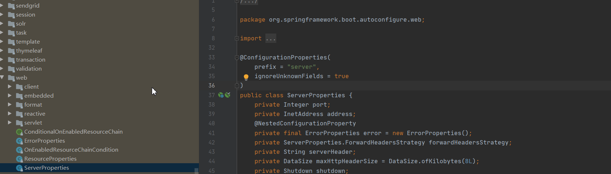
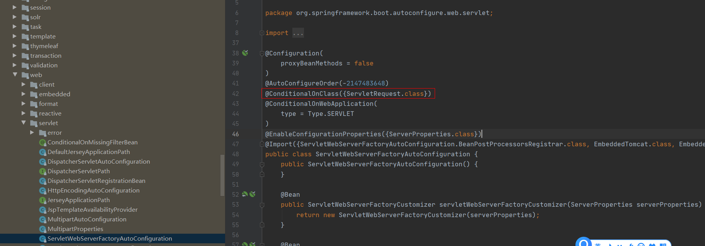
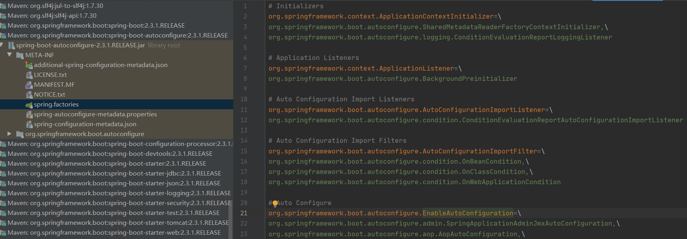
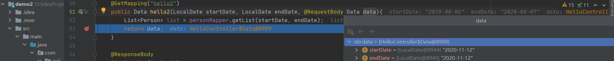
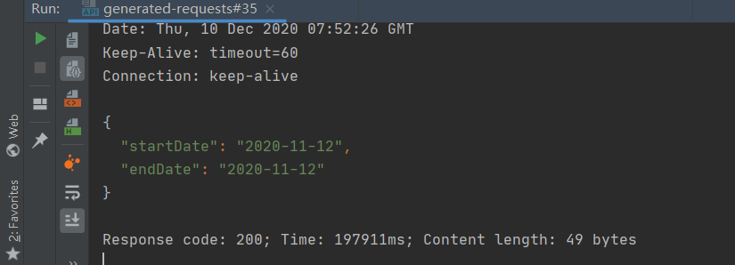
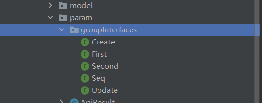

### SpringBoot学习

#### 自动配置原理

配置文件（yaml,properties文件）中配置的值通过`@ConfigurationProperties`注解绑定到对应的XXXProperties类中。



而后通过`@EnableConfigurationProperties`注解指定XXXProperties来加载配置信息到`XXXAutoConfiguration`类中。



spring-boot-autoconfigure-2.3.1.RELEASE.jar中META-INF/spring.factories定义了大量的`XXXAutoConfiguration`：



SpringBoot应用的启动类都有一个注解：`@SpringBootApplication`

该注解的定义：

```java
@Target({ElementType.TYPE})
@Retention(RetentionPolicy.RUNTIME)
@Documented
@Inherited
@SpringBootConfiguration
@EnableAutoConfiguration
@ComponentScan(
    excludeFilters = {@Filter(
    type = FilterType.CUSTOM,
    classes = {TypeExcludeFilter.class}
), @Filter(
    type = FilterType.CUSTOM,
    classes = {AutoConfigurationExcludeFilter.class}
)}
)
public @interface SpringBootApplication {
```

其中的`@EnableAutoConfiguration`通过`@Import({AutoConfigurationImportSelector.class})`完成对AutoConfiguration类的加载：

```java
@Target({ElementType.TYPE})
@Retention(RetentionPolicy.RUNTIME)
@Documented
@Inherited
@AutoConfigurationPackage
@Import({AutoConfigurationImportSelector.class})
public @interface EnableAutoConfiguration {
    String ENABLED_OVERRIDE_PROPERTY = "spring.boot.enableautoconfiguration";

    Class<?>[] exclude() default {};

    String[] excludeName() default {};
}
```

总结：

1. 当应用启动时，@SpringBootApplication中的@EnableAutoConfiguration通过@Import({AutoConfigurationImportSelector.class})加载spring-boot-autoconfigure-2.3.1.RELEASE.jar下的META-INF/spring.factories中定义自动配置组件。
2. 每一个组件又通过`@EnableConfigurationProperties`注解来加载ServerProperties类信息。
3. ServerProperties类通过@ConfigurationProperties注解去加载配置文件（yaml,properties）中定义的值。

#### 支持java8时间API

```java
package com.cwj.config;

import com.fasterxml.jackson.databind.ObjectMapper;
import com.fasterxml.jackson.databind.SerializationFeature;
import com.fasterxml.jackson.databind.deser.std.DateDeserializers;
import com.fasterxml.jackson.databind.ser.std.DateSerializer;
import com.fasterxml.jackson.datatype.jsr310.JavaTimeModule;
import com.fasterxml.jackson.datatype.jsr310.deser.LocalDateTimeDeserializer;
import com.fasterxml.jackson.datatype.jsr310.ser.LocalDateTimeSerializer;
import org.springframework.beans.factory.annotation.Value;
import org.springframework.boot.autoconfigure.jackson.Jackson2ObjectMapperBuilderCustomizer;
import org.springframework.context.annotation.Bean;
import org.springframework.context.annotation.Configuration;
import org.springframework.http.converter.json.Jackson2ObjectMapperBuilder;

import java.text.SimpleDateFormat;
import java.time.LocalDateTime;
import java.time.format.DateTimeFormatter;
import java.util.Date;

@Configuration
public class LocalDateTimeSerializerConfig {

    @Value("${spring.jackson.date-format:yyyy-MM-dd HH:mm:ss}")
    private String pattern;

    @Bean
    public LocalDateTimeSerializer localDateTimeSerializer() {
        return new LocalDateTimeSerializer(DateTimeFormatter.ofPattern(pattern));
    }

    @Bean
    public DateSerializer dateSerializer() {
        return new DateSerializer(true, new SimpleDateFormat(pattern));
    }

    @Bean
    public Jackson2ObjectMapperBuilderCustomizer jackson2ObjectMapperBuilderCustomizer() {
        return builder -> builder
                .serializerByType(LocalDateTime.class, localDateTimeSerializer())
//                .serializerByType(Date.class, dateSerializer())
                ;
    }

    @Bean
    public ObjectMapper serializingObjectMapper() {
        JavaTimeModule module = new JavaTimeModule();
        LocalDateTimeDeserializer dateTimeDeserializer = new LocalDateTimeDeserializer(DateTimeFormatter.ofPattern("yyyy-MM-dd HH:mm:ss"));
//        MyLocalDateTimeDeserializer myLocalDateTimeDeserializer = new MyLocalDateTimeDeserializer(DateTimeFormatter.ofPattern("yyyy-MM-dd HH:mm:ss"));
        DateDeserializers.DateDeserializer deserializer = new DateDeserializers.DateDeserializer(DateDeserializers.DateDeserializer.instance, new SimpleDateFormat(pattern), pattern);
        module.addDeserializer(LocalDateTime.class, dateTimeDeserializer);
        module.addSerializer(LocalDateTime.class, localDateTimeSerializer());
        module.addSerializer(Date.class, DateSerializer.instance.withFormat(false, new SimpleDateFormat(pattern)));
        module.addDeserializer(Date.class, deserializer);
        return Jackson2ObjectMapperBuilder.json().modules(module)
                .featuresToDisable(SerializationFeature.WRITE_DATES_AS_TIMESTAMPS).build();
    }
}
```

```java
package com.cwj.config;

import lombok.SneakyThrows;
import org.springframework.context.annotation.Bean;
import org.springframework.context.annotation.Configuration;
import org.springframework.core.convert.converter.Converter;

import java.text.SimpleDateFormat;
import java.time.LocalDate;
import java.time.LocalDateTime;
import java.time.format.DateTimeFormatter;
import java.util.Date;

@Configuration
public class DateConverterConfig {
    @Bean
    public Converter<String, LocalDate> localDateConverter() {
        return new Converter<String, LocalDate>() {
            @Override
            public LocalDate convert(String source) {
                return LocalDate.parse(source, DateTimeFormatter.ofPattern("yyyy-MM-dd"));
            }
        };
    }

    @Bean
    public Converter<String, LocalDateTime> localDateTimeConverter() {
        return new Converter<String, LocalDateTime>() {
            @Override
            public LocalDateTime convert(String source) {
                return LocalDateTime.parse(source, DateTimeFormatter.ofPattern("yyyy-MM-dd HH:mm:ss"));
            }
        };
    }

    @Bean
    public Converter<String, Date> dateConverter() {
        return new Converter<String, Date>() {
            @SneakyThrows
            @Override
            public Date convert(String source) {
                return new SimpleDateFormat("yyyy-MM-dd HH:mm:ss").parse(source);
            }
        };
    }
}
```

代码应用：

**controller:**

```java
@ResponseBody
@GetMapping("hello2")
public Data hello2(LocalDate startDate, LocalDate endDate, @RequestBody Data data){
    List<Person> list = personMapper.getList(startDate, endDate);
    return data;
}
static class Data{
    private LocalDate startDate;
    private LocalDate endDate;

    public LocalDate getStartDate() {
    return startDate;
    }

    public void setStartDate(LocalDate startDate) {
    this.startDate = startDate;
    }

    public LocalDate getEndDate() {
    return endDate;
    }

    public void setEndDate(LocalDate endDate) {
    this.endDate = endDate;
    }
}
```

**mapper.java**

```java
List<Person> getList(@Param("startDate") LocalDate startDate, @Param("endDate") LocalDate endDate);
```

**mapper.xml**

```xml
<select id="getList" resultType="com.cwj.demo2.model.Person">
        select * from person
        <where>
            <if test="startDate != null">
                and create_time >= #{startDate}
            </if>
            <if test="endDate != null">
                and create_time &lt; #{endDate}
            </if>
        </where>
        order by create_time
    </select>
```

**请求：**

```http
###
GET http://localhost:8085/hello2?startDate=2020-08-06&endDate=2020-08-07
Content-Type: application/json

{
  "startDate": "2020-11-12",
  "endDate": "2020-11-12"
}
```

**debug：**




**返回json:**



数据库person表：

CREATE TABLE `person` (
  `id` int(11) unsigned NOT NULL AUTO_INCREMENT,
  `name` varchar(16) DEFAULT NULL,
  `address` varchar(16) DEFAULT NULL,
  `age` int(3) DEFAULT NULL,
  `create_time` datetime DEFAULT NULL,
  `update_time` timestamp NULL DEFAULT NULL,
  PRIMARY KEY (`id`)
) ENGINE=InnoDB AUTO_INCREMENT=52 DEFAULT CHARSET=utf8mb4;

数据：

2	tom	上海	18	2020-08-05 00:00:00	2020-08-06 16:08:00
3	tom	上海	18	2020-08-05 01:00:00	2020-08-06 16:08:00
4	tom	上海	18	2020-08-05 02:00:00	2020-08-06 16:08:00
5	tom	上海	18	2020-08-05 03:00:00	2020-08-06 16:08:00
6	tom	上海	18	2020-08-05 04:00:00	2020-08-06 16:08:00
7	tom	上海	18	2020-08-05 05:00:00	2020-08-06 16:08:00
8	tom	上海	18	2020-08-05 06:00:00	2020-08-06 16:08:00
9	tom	上海	18	2020-08-05 07:00:00	2020-08-06 16:08:00
10	tom	上海	18	2020-08-05 08:00:00	2020-08-06 16:08:00
11	tom	上海	18	2020-08-05 09:00:00	2020-08-06 16:08:00
12	tom	上海	18	2020-08-05 10:00:00	2020-08-06 16:08:00
13	tom	上海	18	2020-08-05 11:00:00	2020-08-06 16:08:00
14	tom	上海	18	2020-08-05 12:00:00	2020-08-06 16:08:00
15	tom	上海	18	2020-08-05 13:00:00	2020-08-06 16:08:00
16	tom	上海	18	2020-08-05 14:00:00	2020-08-06 16:08:00
17	tom	上海	18	2020-08-05 15:00:00	2020-08-06 16:08:00
18	tom	上海	18	2020-08-05 16:00:00	2020-08-06 16:08:00
19	tom	上海	18	2020-08-05 17:00:00	2020-08-06 16:08:00
20	tom	上海	18	2020-08-05 18:00:00	2020-08-06 16:08:00
21	tom	上海	18	2020-08-05 19:00:00	2020-08-06 16:08:00
22	tom	上海	18	2020-08-05 20:00:00	2020-08-06 16:08:00
23	tom	上海	18	2020-08-05 21:00:00	2020-08-06 16:08:00
24	tom	上海	18	2020-08-05 22:00:00	2020-08-06 16:08:00
25	tom	上海	18	2020-08-05 23:00:00	2020-08-06 16:08:00
51	tom	上海	18	2020-08-06 00:00:00	2020-08-06 16:08:00
26	tom	上海	18	2020-08-06 01:00:00	2020-08-06 16:08:00
27	tom	上海	18	2020-08-06 02:00:00	2020-08-06 16:08:00
28	tom	上海	18	2020-08-06 03:00:00	2020-08-06 16:08:00
29	tom	上海	18	2020-08-06 04:00:00	2020-08-06 16:08:00
30	tom	上海	18	2020-08-06 05:00:00	2020-08-06 16:08:00
31	tom	上海	18	2020-08-06 06:00:00	2020-08-06 16:08:00
32	tom	上海	18	2020-08-06 07:00:00	2020-08-06 16:08:00
33	tom	上海	18	2020-08-06 08:00:00	2020-08-06 16:08:00
34	tom	上海	18	2020-08-06 09:00:00	2020-08-06 16:08:00
35	tom	上海	18	2020-08-06 10:00:00	2020-08-06 16:08:00
36	tom	上海	18	2020-08-06 11:00:00	2020-08-06 16:08:00
37	tom	上海	18	2020-08-06 12:00:00	2020-08-06 16:08:00
38	tom	上海	18	2020-08-06 13:00:00	2020-08-06 16:08:00
39	tom	上海	18	2020-08-06 14:00:00	2020-08-06 16:08:00
40	tom	上海	18	2020-08-06 15:00:00	2020-08-06 16:08:00
41	tom	上海	18	2020-08-06 16:00:00	2020-08-06 16:08:00
42	tom	上海	18	2020-08-06 17:00:00	2020-08-06 16:08:00
43	tom	上海	18	2020-08-06 18:00:00	2020-08-06 16:08:00
44	tom	上海	18	2020-08-06 19:00:00	2020-08-06 16:08:00
45	tom	上海	18	2020-08-06 20:00:00	2020-08-06 16:08:00
46	tom	上海	18	2020-08-06 21:00:00	2020-08-06 16:08:00
47	tom	上海	18	2020-08-06 22:00:00	2020-08-06 16:08:00
48	tom	上海	18	2020-08-06 23:00:00	2020-08-06 16:08:00
49	tom	上海	18	2020-08-07 00:00:00	2020-08-06 16:08:00
50	tom	上海	18	2020-08-07 01:00:00	2020-08-06 16:08:00

#### 参数校验

##### 1. maven依赖:

```xml
<dependency>
    <groupId>javax.validation</groupId>
    <artifactId>validation-api</artifactId>
</dependency>
<dependency>
    <groupId>org.hibernate.validator</groupId>
    <artifactId>hibernate-validator</artifactId>
</dependency>
```

##### 2. 开启校验模式：快速失败

```java
package com.cwj.demo2.config;

import org.hibernate.validator.HibernateValidator;
import org.springframework.context.annotation.Bean;
import org.springframework.context.annotation.Configuration;

import javax.validation.Validation;
import javax.validation.Validator;
import javax.validation.ValidatorFactory;

@Configuration
public class ValidatorConfig {
    @Bean
    public Validator validator() {
        ValidatorFactory validatorFactory = Validation.byProvider(HibernateValidator.class).configure().failFast(true).buildValidatorFactory();
        return validatorFactory.getValidator();
    }
}

```

##### 3. 配置统一参数校验异常处理：

```java
package com.cwj.demo2.config;

import com.cwj.demo2.param.ApiResult;
import lombok.extern.slf4j.Slf4j;
import org.springframework.http.HttpStatus;
import org.springframework.validation.FieldError;
import org.springframework.web.bind.MethodArgumentNotValidException;
import org.springframework.web.bind.annotation.ExceptionHandler;
import org.springframework.web.bind.annotation.RestControllerAdvice;

import java.util.List;

/**
 * @author chenwujie
 * @date 2020-12-11 10:23
 */
@RestControllerAdvice
@Slf4j
public class GlobalExceptionHandler {

    @ExceptionHandler(MethodArgumentNotValidException.class)
    public ApiResult<?> handleMethodArgumentNotValidException(MethodArgumentNotValidException e) {
        log.error(e.getMessage(), e);

        List<FieldError> fieldErrors = e.getBindingResult().getFieldErrors();
        if (fieldErrors.size() == 1) {
            ApiResult<?> apiResult = new ApiResult<>();
            apiResult.setStatus(HttpStatus.BAD_REQUEST.value());
            FieldError fieldError = fieldErrors.get(0);
            String field = fieldError.getField();
            String message = fieldError.getDefaultMessage();
            apiResult.setMessage(field + ": " + message);
            return apiResult;
        }
        StringBuilder stringBuilder = new StringBuilder();
        for (FieldError fieldError : fieldErrors) {
            String field = fieldError.getField();
            String message = fieldError.getDefaultMessage();
            stringBuilder.append(field);
            stringBuilder.append(": ");
            stringBuilder.append(message);
            stringBuilder.append("; ");
        }
        stringBuilder.replace(stringBuilder.lastIndexOf("; "), stringBuilder.length(), "");

        ApiResult<?> apiResult = new ApiResult<>();
        apiResult.setStatus(HttpStatus.BAD_REQUEST.value());
        apiResult.setMessage(stringBuilder.toString());
        return apiResult;
    }

    @ExceptionHandler(RuntimeException.class)
    public ApiResult<?> handleRuntimeException(RuntimeException e) {
        ApiResult<?> apiResult = new ApiResult<>();
        apiResult.setStatus(HttpStatus.INTERNAL_SERVER_ERROR.value());
        apiResult.setMessage("系统异常");
        return apiResult;
    }
}

```

对目标对象进行校验：

```
    @ResponseBody
    @GetMapping("hello2")
    public Data hello2(LocalDate startDate, LocalDate endDate, @Validated @RequestBody Data data){
        List<Person> list = personMapper.getList(startDate, endDate);
        return data;
    }
```

注解：@Validated 表示对 Data对象执行校验，校验规则需要在实例字段上添加注解：

```
package com.cwj.demo2.param;

import com.cwj.demo2.model.Person;
import com.cwj.demo2.param.groupInterfaces.Create;
import com.cwj.demo2.param.groupInterfaces.First;
import com.cwj.demo2.param.groupInterfaces.Second;
import com.cwj.demo2.param.groupInterfaces.Update;

import javax.validation.GroupSequence;
import javax.validation.Valid;
import javax.validation.constraints.NotEmpty;
import javax.validation.constraints.Past;
import java.time.LocalDate;
import java.util.List;

/**
 * @author chenwujie
 * @date 2020-12-11 14:23
 */
public class Data {
    @Past(groups = {Create.class, Second.class})
    private LocalDate startDate;
    @Past(groups = {Update.class, First.class})
    private LocalDate endDate;
    @NotEmpty
    @Valid
    private List<Person> personList;

    public List<Person> getPersonList() {
        return personList;
    }

    public void setPersonList(List<Person> personList) {
        this.personList = personList;
    }

    public LocalDate getStartDate() {
        return startDate;
    }

    public void setStartDate(LocalDate startDate) {
        this.startDate = startDate;
    }

    public LocalDate getEndDate() {
        return endDate;
    }

    public void setEndDate(LocalDate endDate) {
        this.endDate = endDate;
    }
}

```

##### 4. 分组校验：

1. 定义分组：

   

   ```java
   package com.cwj.demo2.param.groupInterfaces;
   
   /**
    * @author chenwujie
    * @date 2020-12-11 14:25
    */
   public interface Create {
   }
   --------------------------
   package com.cwj.demo2.param.groupInterfaces;
   
   /**
    * @author chenwujie
    * @date 2020-12-11 14:26
    */
   public interface Update {
   }
   
   ```

2. 在校验规则注解中添加分组信息：

   ```java
       @Past(groups = {Create.class, Second.class})
       private LocalDate startDate;
       @Past(groups = {Update.class, First.class})
       private LocalDate endDate;
   ```

3. 在注解@Validated中指定分组：

   ```java
       @ResponseBody
       @GetMapping("hello2")
       public Data hello2(LocalDate startDate, LocalDate endDate, @Validated({Update.class}) @RequestBody Data data){
           List<Person> list = personMapper.getList(startDate, endDate);
           return data;
       }
   ```

##### 5. 校验顺序：

1. 定义顺序：

   ```java
   package com.cwj.demo2.param.groupInterfaces;
   
   import javax.validation.GroupSequence;
   
   /**
    * @author chenwujie
    * @date 2020-12-11 14:26
    */
   @GroupSequence({First.class, Second.class})
   public interface Seq {
   }
   -------------------------------
   package com.cwj.demo2.param.groupInterfaces;
   
   /**
    * @author chenwujie
    * @date 2020-12-11 14:26
    */
   public interface First {
   }
   ----------------------------------
   package com.cwj.demo2.param.groupInterfaces;
   
   /**
    * @author chenwujie
    * @date 2020-12-11 14:27
    */
   public interface Second {
   }
   
   ```

2. 校验规则注解添加顺序组

   ```java
    @Past(groups = {Create.class, Second.class})
    private LocalDate startDate;
    @Past(groups = {Update.class, First.class})
    private LocalDate endDate;
   ```

3. 在@Validated中指定顺序：

   ```java
       @ResponseBody
       @GetMapping("hello2")
       public Data hello2(LocalDate startDate, LocalDate endDate, @Validated({Update.class, Seq.class}) @RequestBody Data data){
           List<Person> list = personMapper.getList(startDate, endDate);
           return data;
       }
   ```

##### 6. 级联校验

1. 在对象的复杂对象字段上添加注解：@Valid

   ```
       @NotEmpty	// 只校验personList的元素个数
       @Valid		// 对Person实例进行校验
       private List<Person> personList;
   ```

2. 在Person类中添加校验注解：

   ```java
   package com.cwj.demo2.model;
   
   import com.cwj.demo2.param.groupInterfaces.Create;
   import lombok.Data;
   import org.hibernate.validator.constraints.Length;
   
   import javax.persistence.GeneratedValue;
   import javax.persistence.GenerationType;
   import javax.persistence.Id;
   import javax.persistence.Table;
   import java.time.LocalDateTime;
   
   /**
    * @author chenwujie
    * @date 2020-12-10 11:15
    */
   @Data
   @Table(name = "person")
   public class Person {
       @Id
       @GeneratedValue(strategy = GenerationType.IDENTITY)
       private Integer id;
       @Length(min = 10, message = "名字过短",groups = Create.class)
       private String name;
       private String address;
       private Integer age;
       private LocalDateTime createTime;
       private LocalDateTime updateTime;
   }
   ```

#### 日志框架：

**logback-spring.xml**

```xml
<?xml version="1.0" encoding="UTF-8"?>
<configuration scan="true" scanPeriod="10 seconds">
    <!-- 日志级别从低到高分为TRACE < DEBUG < INFO < WARN < ERROR < FATAL，如果设置为WARN，则低于WARN的信息都不会输出 -->
    <!-- scan:当此属性设置为true时，配置文件如果发生改变，将会被重新加载，默认值为true -->
    <!-- scanPeriod:设置监测配置文件是否有修改的时间间隔，如果没有给出时间单位，默认单位是毫秒。当scan为true时，此属性生效。默认的时间间隔为1分钟。 -->
    <!-- debug:当此属性设置为true时，将打印出logback内部日志信息，实时查看logback运行状态。默认值为false。 -->
    <contextName>logback</contextName>

    <property name="APP_NAME" value="myApp"/><!-- 项目名 -->
    <property name="LOG_HOME_DEV" value="c:/logs/${APP_NAME}"/><!-- 本地运行环境 -->
    <property name="LOG_HOME_TEST" value="c:/home/logs/${APP_NAME}"/><!--test环境 -->
    <property name="LOG_HOME_PROD" value="c:/logs/${APP_NAME}"/><!-- 生产环境 -->
    <springProfile name="dev">
        <property name="LOG_HOME" value="${LOG_HOME_DEV}"/><!-- 本地运行环境 -->
    </springProfile>
    <springProfile name="prod">
        <property name="LOG_HOME" value="${LOG_HOME_PROD}"/><!-- 本地运行环境 -->
    </springProfile>
    <springProfile name="test">
        <property name="LOG_HOME" value="${LOG_HOME_TEST}"/><!-- 本地运行环境 -->
    </springProfile>

    <!-- 彩色日志 -->
    <!-- 配置格式变量：CONSOLE_LOG_PATTERN 彩色日志格式 -->
    <!-- magenta:洋红 -->
    <!-- boldMagenta:粗红-->
    <!-- cyan:青色 -->
    <!-- white:白色 -->
    <!-- magenta:洋红 -->
    <property name="CONSOLE_LOG_PATTERN"
              value="%yellow(%date{yyyy-MM-dd HH:mm:ss}) |%highlight(%-5level) |%blue(%thread) |%blue(%file:%line) |%green(%logger) |%cyan(%msg%n)"/>


    <!--输出到控制台-->
    <appender name="CONSOLE" class="ch.qos.logback.core.ConsoleAppender">
        <encoder>
            <Pattern>${CONSOLE_LOG_PATTERN}</Pattern>
            <!-- 设置字符集 -->
            <charset>UTF-8</charset>
        </encoder>
    </appender>


    <!--输出到文件-->
    <appender name="ALL_FILE" class="ch.qos.logback.core.rolling.RollingFileAppender">
        <!-- 正在记录的日志文件的路径及文件名 -->
        <file>${LOG_HOME}/all.log</file>
        <!--日志文件输出格式-->
        <encoder>
            <pattern>%d{yyyy-MM-dd HH:mm:ss.SSS} [%thread] %-5level %logger{50} - %msg%n</pattern>
            <charset>UTF-8</charset>
        </encoder>
        <!-- 日志记录器的滚动策略，按日期，按大小记录 -->
        <rollingPolicy class="ch.qos.logback.core.rolling.TimeBasedRollingPolicy">
            <!-- 每天日志归档路径以及格式 -->
            <fileNamePattern>${LOG_HOME}/%d{yyyy-MM-dd}/all-%d{yyyy-MM-dd}.%i.log</fileNamePattern>
            <timeBasedFileNamingAndTriggeringPolicy class="ch.qos.logback.core.rolling.SizeAndTimeBasedFNATP">
                <maxFileSize>100MB</maxFileSize>
            </timeBasedFileNamingAndTriggeringPolicy>
            <!--日志文件保留天数-->
            <maxHistory>15</maxHistory>
        </rollingPolicy>
    </appender>
    <!-- 时间滚动输出 level为 INFO 日志 -->
    <appender name="INFO_FILE" class="ch.qos.logback.core.rolling.RollingFileAppender">
        <!-- 正在记录的日志文件的路径及文件名 -->
        <file>${LOG_HOME}/info.log</file>
        <!--日志文件输出格式-->
        <encoder>
            <pattern>%d{yyyy-MM-dd HH:mm:ss.SSS} [%thread] %-5level %logger{50} - %msg%n</pattern>
            <charset>UTF-8</charset>
        </encoder>
        <!-- 日志记录器的滚动策略，按日期，按大小记录 -->
        <rollingPolicy class="ch.qos.logback.core.rolling.TimeBasedRollingPolicy">
            <!-- 每天日志归档路径以及格式 -->
            <fileNamePattern>${LOG_HOME}/%d{yyyy-MM-dd}/info-%d{yyyy-MM-dd}.%i.log</fileNamePattern>
            <timeBasedFileNamingAndTriggeringPolicy class="ch.qos.logback.core.rolling.SizeAndTimeBasedFNATP">
                <maxFileSize>100MB</maxFileSize>
            </timeBasedFileNamingAndTriggeringPolicy>
            <!--日志文件保留天数-->
            <maxHistory>15</maxHistory>
        </rollingPolicy>
        <!-- 此日志文件只记录info级别的 -->
        <filter class="ch.qos.logback.classic.filter.LevelFilter">
            <level>INFO</level>
            <onMatch>ACCEPT</onMatch>
            <onMismatch>DENY</onMismatch>
        </filter>
    </appender>

    <!-- 时间滚动输出 level为 WARN 日志 -->
    <appender name="WARN_FILE" class="ch.qos.logback.core.rolling.RollingFileAppender">
        <!-- 正在记录的日志文件的路径及文件名 -->
        <file>${LOG_HOME}/warn.log</file>
        <!--日志文件输出格式-->
        <encoder>
            <pattern>%d{yyyy-MM-dd HH:mm:ss.SSS} [%thread] %-5level %logger{50} - %msg%n</pattern>
            <charset>UTF-8</charset> <!-- 此处设置字符集 -->
        </encoder>
        <!-- 日志记录器的滚动策略，按日期，按大小记录 -->
        <rollingPolicy class="ch.qos.logback.core.rolling.TimeBasedRollingPolicy">
            <fileNamePattern>${LOG_HOME}/%d{yyyy-MM-dd}/warn-%d{yyyy-MM-dd}.%i.log</fileNamePattern>
            <timeBasedFileNamingAndTriggeringPolicy class="ch.qos.logback.core.rolling.SizeAndTimeBasedFNATP">
                <maxFileSize>100MB</maxFileSize>
            </timeBasedFileNamingAndTriggeringPolicy>
            <!--日志文件保留天数-->
            <maxHistory>15</maxHistory>
        </rollingPolicy>
        <!-- 此日志文件只记录warn级别的 -->
        <filter class="ch.qos.logback.classic.filter.LevelFilter">
            <level>WARN</level>
            <onMatch>ACCEPT</onMatch>
            <onMismatch>DENY</onMismatch>
        </filter>
    </appender>


    <!-- 时间滚动输出 level为 ERROR 日志 -->
    <appender name="ERROR_FILE" class="ch.qos.logback.core.rolling.RollingFileAppender">
        <!-- 正在记录的日志文件的路径及文件名 -->
        <file>${LOG_HOME}/error.log</file>
        <!--日志文件输出格式-->
        <encoder>
            <pattern>%d{yyyy-MM-dd HH:mm:ss.SSS} [%thread] %-5level %logger{50} - %msg%n</pattern>
            <charset>UTF-8</charset> <!-- 此处设置字符集 -->
        </encoder>
        <!-- 日志记录器的滚动策略，按日期，按大小记录 -->
        <rollingPolicy class="ch.qos.logback.core.rolling.TimeBasedRollingPolicy">
            <fileNamePattern>${LOG_HOME}/%d{yyyy-MM-dd}/error-%d{yyyy-MM-dd}.%i.log</fileNamePattern>
            <timeBasedFileNamingAndTriggeringPolicy class="ch.qos.logback.core.rolling.SizeAndTimeBasedFNATP">
                <maxFileSize>100MB</maxFileSize>
            </timeBasedFileNamingAndTriggeringPolicy>
            <!--日志文件保留天数-->
            <maxHistory>15</maxHistory>
        </rollingPolicy>
        <!-- 此日志文件只记录ERROR级别的 -->
        <filter class="ch.qos.logback.classic.filter.LevelFilter">
            <level>ERROR</level>
            <onMatch>ACCEPT</onMatch>
            <onMismatch>DENY</onMismatch>
        </filter>
    </appender>

    <!--
        <logger>用来设置某一个包或者具体的某一个类的日志打印级别、以及指定<appender>。
        <logger>仅有一个name属性，
        一个可选的level和一个可选的addtivity属性。
        name:用来指定受此logger约束的某一个包或者具体的某一个类。
        level:用来设置打印级别，大小写无关：TRACE, DEBUG, INFO, WARN, ERROR, ALL 和 OFF，
              如果未设置此属性，那么当前logger将会继承上级的级别。
    -->
    <!--
        使用mybatis的时候，sql语句是debug下才会打印，而这里我们只配置了info，所以想要查看sql语句的话，有以下两种操作：
        第一种把<root level="INFO">改成<root level="DEBUG">这样就会打印sql，不过这样日志那边会出现很多其他消息
        第二种就是单独给mapper下目录配置DEBUG模式，代码如下，这样配置sql语句会打印，其他还是正常DEBUG级别：
     -->
    <!--可以输出项目中的debug日志，包括mybatis的sql日志-->
    <!--    <logger name="com.unicom.uac.mapper" level="DEBUG" addtivity="false" />-->
    <!--
        root节点是必选节点，用来指定最基础的日志输出级别，只有一个level属性
        level:用来设置打印级别，大小写无关：TRACE, DEBUG, INFO, WARN, ERROR, ALL 和 OFF，默认是DEBUG
        可以包含零个或多个appender元素。
    -->
    <logger name="com.cwj.demo2.mapper" level="DEBUG" addtivity="false" />
    <springProfile name="dev | test">
        <property name="ROOT_LEVEL" value="INFO"/>
    </springProfile>
    <springProfile name="prod">
        <property name="ROOT_LEVEL" value="ERROR"/>
    </springProfile>
    <root level="${ROOT_LEVEL}">
        <appender-ref ref="CONSOLE" />
        <appender-ref ref="ALL_FILE" />
        <appender-ref ref="INFO_FILE" />
        <appender-ref ref="WARN_FILE" />
        <appender-ref ref="ERROR_FILE" />
    </root>

</configuration>
```

