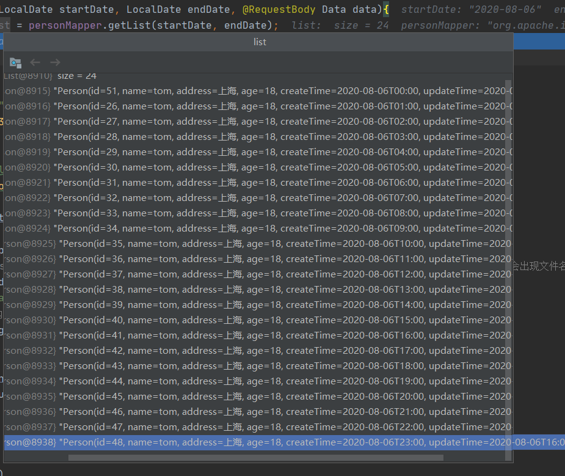

### SpringBoot学习

#### spring自动配置原理

配置文件（yaml,properties文件）中配置的值通过`@ConfigurationProperties`注解绑定到对应的XXXProperties类中。


而后通过`@EnableConfigurationProperties`注解指定XXXProperties来加载配置信息到`XXXAutoConfiguration`类中。


spring-boot-autoconfigure-2.3.1.RELEASE.jar中META-INF/spring.factories定义了大量的`XXXAutoConfiguration`：


SpringBoot应用的启动类都有一个注解：`@SpringBootApplication`

该注解的定义：

```java
@Target({ElementType.TYPE})
@Retention(RetentionPolicy.RUNTIME)
@Documented
@Inherited
@SpringBootConfiguration
@EnableAutoConfiguration
@ComponentScan(
    excludeFilters = {@Filter(
    type = FilterType.CUSTOM,
    classes = {TypeExcludeFilter.class}
), @Filter(
    type = FilterType.CUSTOM,
    classes = {AutoConfigurationExcludeFilter.class}
)}
)
public @interface SpringBootApplication {
```

其中的`@EnableAutoConfiguration`通过`@Import({AutoConfigurationImportSelector.class})`完成对AutoConfiguration类的加载：

```java
@Target({ElementType.TYPE})
@Retention(RetentionPolicy.RUNTIME)
@Documented
@Inherited
@AutoConfigurationPackage
@Import({AutoConfigurationImportSelector.class})
public @interface EnableAutoConfiguration {
    String ENABLED_OVERRIDE_PROPERTY = "spring.boot.enableautoconfiguration";

    Class<?>[] exclude() default {};

    String[] excludeName() default {};
}
```

总结：

1. 当应用启动时，@SpringBootApplication中的@EnableAutoConfiguration通过@Import({AutoConfigurationImportSelector.class})加载spring-boot-autoconfigure-2.3.1.RELEASE.jar下的META-INF/spring.factories中定义自动配置组件。
2. 每一个组件又通过`@EnableConfigurationProperties`注解来加载ServerProperties类信息。
3. ServerProperties类通过@ConfigurationProperties注解去加载配置文件（yaml,properties）中定义的值。

#### 配置java8新的时间API对序列化，反序列化，参数绑定

```java
package com.cwj.config;

import com.fasterxml.jackson.databind.ObjectMapper;
import com.fasterxml.jackson.databind.SerializationFeature;
import com.fasterxml.jackson.databind.deser.std.DateDeserializers;
import com.fasterxml.jackson.databind.ser.std.DateSerializer;
import com.fasterxml.jackson.datatype.jsr310.JavaTimeModule;
import com.fasterxml.jackson.datatype.jsr310.deser.LocalDateTimeDeserializer;
import com.fasterxml.jackson.datatype.jsr310.ser.LocalDateTimeSerializer;
import org.springframework.beans.factory.annotation.Value;
import org.springframework.boot.autoconfigure.jackson.Jackson2ObjectMapperBuilderCustomizer;
import org.springframework.context.annotation.Bean;
import org.springframework.context.annotation.Configuration;
import org.springframework.http.converter.json.Jackson2ObjectMapperBuilder;

import java.text.SimpleDateFormat;
import java.time.LocalDateTime;
import java.time.format.DateTimeFormatter;
import java.util.Date;

@Configuration
public class LocalDateTimeSerializerConfig {

    @Value("${spring.jackson.date-format:yyyy-MM-dd HH:mm:ss}")
    private String pattern;

    @Bean
    public LocalDateTimeSerializer localDateTimeSerializer() {
        return new LocalDateTimeSerializer(DateTimeFormatter.ofPattern(pattern));
    }

    @Bean
    public DateSerializer dateSerializer() {
        return new DateSerializer(true, new SimpleDateFormat(pattern));
    }

    @Bean
    public Jackson2ObjectMapperBuilderCustomizer jackson2ObjectMapperBuilderCustomizer() {
        return builder -> builder
                .serializerByType(LocalDateTime.class, localDateTimeSerializer())
//                .serializerByType(Date.class, dateSerializer())
                ;
    }

    @Bean
    public ObjectMapper serializingObjectMapper() {
        JavaTimeModule module = new JavaTimeModule();
        LocalDateTimeDeserializer dateTimeDeserializer = new LocalDateTimeDeserializer(DateTimeFormatter.ofPattern("yyyy-MM-dd HH:mm:ss"));
//        MyLocalDateTimeDeserializer myLocalDateTimeDeserializer = new MyLocalDateTimeDeserializer(DateTimeFormatter.ofPattern("yyyy-MM-dd HH:mm:ss"));
        DateDeserializers.DateDeserializer deserializer = new DateDeserializers.DateDeserializer(DateDeserializers.DateDeserializer.instance, new SimpleDateFormat(pattern), pattern);
        module.addDeserializer(LocalDateTime.class, dateTimeDeserializer);
        module.addSerializer(LocalDateTime.class, localDateTimeSerializer());
        module.addSerializer(Date.class, DateSerializer.instance.withFormat(false, new SimpleDateFormat(pattern)));
        module.addDeserializer(Date.class, deserializer);
        return Jackson2ObjectMapperBuilder.json().modules(module)
                .featuresToDisable(SerializationFeature.WRITE_DATES_AS_TIMESTAMPS).build();
    }
}
```

```java
package com.cwj.config;

import lombok.SneakyThrows;
import org.springframework.context.annotation.Bean;
import org.springframework.context.annotation.Configuration;
import org.springframework.core.convert.converter.Converter;

import java.text.SimpleDateFormat;
import java.time.LocalDate;
import java.time.LocalDateTime;
import java.time.format.DateTimeFormatter;
import java.util.Date;

@Configuration
public class DateConverterConfig {
    @Bean
    public Converter<String, LocalDate> localDateConverter() {
        return new Converter<String, LocalDate>() {
            @Override
            public LocalDate convert(String source) {
                return LocalDate.parse(source, DateTimeFormatter.ofPattern("yyyy-MM-dd"));
            }
        };
    }

    @Bean
    public Converter<String, LocalDateTime> localDateTimeConverter() {
        return new Converter<String, LocalDateTime>() {
            @Override
            public LocalDateTime convert(String source) {
                return LocalDateTime.parse(source, DateTimeFormatter.ofPattern("yyyy-MM-dd HH:mm:ss"));
            }
        };
    }

    @Bean
    public Converter<String, Date> dateConverter() {
        return new Converter<String, Date>() {
            @SneakyThrows
            @Override
            public Date convert(String source) {
                return new SimpleDateFormat("yyyy-MM-dd HH:mm:ss").parse(source);
            }
        };
    }
}
```

代码应用：

**controller:**

```java
@ResponseBody
@GetMapping("hello2")
public Data hello2(LocalDate startDate, LocalDate endDate, @RequestBody Data data){
    List<Person> list = personMapper.getList(startDate, endDate);
    return data;
}
static class Data{
    private LocalDate startDate;
    private LocalDate endDate;

    public LocalDate getStartDate() {
    return startDate;
    }

    public void setStartDate(LocalDate startDate) {
    this.startDate = startDate;
    }

    public LocalDate getEndDate() {
    return endDate;
    }

    public void setEndDate(LocalDate endDate) {
    this.endDate = endDate;
    }
}
```

**mapper.java**

```java
List<Person> getList(@Param("startDate") LocalDate startDate, @Param("endDate") LocalDate endDate);
```

**mapper.xml**

```xml
<select id="getList" resultType="com.cwj.demo2.model.Person">
        select * from person
        <where>
            <if test="startDate != null">
                and create_time >= #{startDate}
            </if>
            <if test="endDate != null">
                and create_time &lt; #{endDate}
            </if>
        </where>
        order by create_time
    </select>
```

**请求：**

```http
###
GET http://localhost:8085/hello2?startDate=2020-08-06&endDate=2020-08-07
Content-Type: application/json

{
  "startDate": "2020-11-12",
  "endDate": "2020-11-12"
}
```

**debug：**




**返回json:**


数据库person表：

CREATE TABLE `person` (
  `id` int(11) unsigned NOT NULL AUTO_INCREMENT,
  `name` varchar(16) DEFAULT NULL,
  `address` varchar(16) DEFAULT NULL,
  `age` int(3) DEFAULT NULL,
  `create_time` datetime DEFAULT NULL,
  `update_time` timestamp NULL DEFAULT NULL,
  PRIMARY KEY (`id`)
) ENGINE=InnoDB AUTO_INCREMENT=52 DEFAULT CHARSET=utf8mb4;

数据：

2	tom	上海	18	2020-08-05 00:00:00	2020-08-06 16:08:00
3	tom	上海	18	2020-08-05 01:00:00	2020-08-06 16:08:00
4	tom	上海	18	2020-08-05 02:00:00	2020-08-06 16:08:00
5	tom	上海	18	2020-08-05 03:00:00	2020-08-06 16:08:00
6	tom	上海	18	2020-08-05 04:00:00	2020-08-06 16:08:00
7	tom	上海	18	2020-08-05 05:00:00	2020-08-06 16:08:00
8	tom	上海	18	2020-08-05 06:00:00	2020-08-06 16:08:00
9	tom	上海	18	2020-08-05 07:00:00	2020-08-06 16:08:00
10	tom	上海	18	2020-08-05 08:00:00	2020-08-06 16:08:00
11	tom	上海	18	2020-08-05 09:00:00	2020-08-06 16:08:00
12	tom	上海	18	2020-08-05 10:00:00	2020-08-06 16:08:00
13	tom	上海	18	2020-08-05 11:00:00	2020-08-06 16:08:00
14	tom	上海	18	2020-08-05 12:00:00	2020-08-06 16:08:00
15	tom	上海	18	2020-08-05 13:00:00	2020-08-06 16:08:00
16	tom	上海	18	2020-08-05 14:00:00	2020-08-06 16:08:00
17	tom	上海	18	2020-08-05 15:00:00	2020-08-06 16:08:00
18	tom	上海	18	2020-08-05 16:00:00	2020-08-06 16:08:00
19	tom	上海	18	2020-08-05 17:00:00	2020-08-06 16:08:00
20	tom	上海	18	2020-08-05 18:00:00	2020-08-06 16:08:00
21	tom	上海	18	2020-08-05 19:00:00	2020-08-06 16:08:00
22	tom	上海	18	2020-08-05 20:00:00	2020-08-06 16:08:00
23	tom	上海	18	2020-08-05 21:00:00	2020-08-06 16:08:00
24	tom	上海	18	2020-08-05 22:00:00	2020-08-06 16:08:00
25	tom	上海	18	2020-08-05 23:00:00	2020-08-06 16:08:00
51	tom	上海	18	2020-08-06 00:00:00	2020-08-06 16:08:00
26	tom	上海	18	2020-08-06 01:00:00	2020-08-06 16:08:00
27	tom	上海	18	2020-08-06 02:00:00	2020-08-06 16:08:00
28	tom	上海	18	2020-08-06 03:00:00	2020-08-06 16:08:00
29	tom	上海	18	2020-08-06 04:00:00	2020-08-06 16:08:00
30	tom	上海	18	2020-08-06 05:00:00	2020-08-06 16:08:00
31	tom	上海	18	2020-08-06 06:00:00	2020-08-06 16:08:00
32	tom	上海	18	2020-08-06 07:00:00	2020-08-06 16:08:00
33	tom	上海	18	2020-08-06 08:00:00	2020-08-06 16:08:00
34	tom	上海	18	2020-08-06 09:00:00	2020-08-06 16:08:00
35	tom	上海	18	2020-08-06 10:00:00	2020-08-06 16:08:00
36	tom	上海	18	2020-08-06 11:00:00	2020-08-06 16:08:00
37	tom	上海	18	2020-08-06 12:00:00	2020-08-06 16:08:00
38	tom	上海	18	2020-08-06 13:00:00	2020-08-06 16:08:00
39	tom	上海	18	2020-08-06 14:00:00	2020-08-06 16:08:00
40	tom	上海	18	2020-08-06 15:00:00	2020-08-06 16:08:00
41	tom	上海	18	2020-08-06 16:00:00	2020-08-06 16:08:00
42	tom	上海	18	2020-08-06 17:00:00	2020-08-06 16:08:00
43	tom	上海	18	2020-08-06 18:00:00	2020-08-06 16:08:00
44	tom	上海	18	2020-08-06 19:00:00	2020-08-06 16:08:00
45	tom	上海	18	2020-08-06 20:00:00	2020-08-06 16:08:00
46	tom	上海	18	2020-08-06 21:00:00	2020-08-06 16:08:00
47	tom	上海	18	2020-08-06 22:00:00	2020-08-06 16:08:00
48	tom	上海	18	2020-08-06 23:00:00	2020-08-06 16:08:00
49	tom	上海	18	2020-08-07 00:00:00	2020-08-06 16:08:00
50	tom	上海	18	2020-08-07 01:00:00	2020-08-06 16:08:00