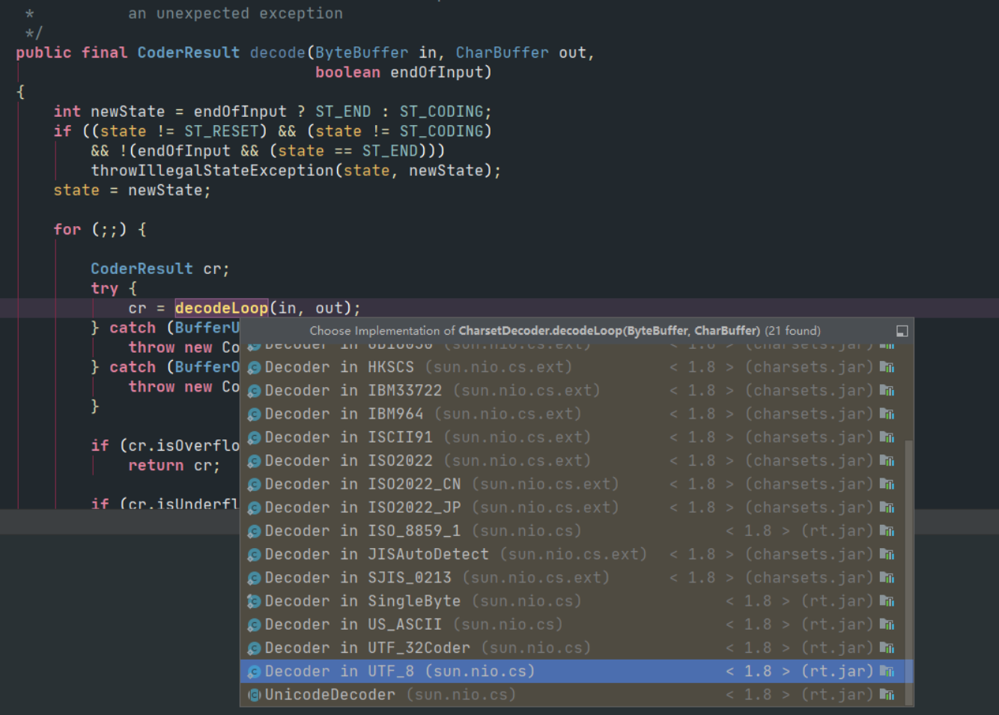

### String

###### Java是如何来存储字符串的？

通过一个字符数组来存储字符序列。并且不可修改。

```java
	/** The value is used for character storage. */

	private final char value[];

	/** Cache the hash code for the string */

    private int hash; // Default to 0
```

###### 字符串常用的构造函数：

```java
public String() {
    this.value = "".value;
}
public String(String original) {

    this.value = original.value;

    this.hash = original.hash;

}
```

用字符数组创建字符串，底层使用本地方法System.arraycopy()，通过移动指针分配内存：

```java
public String(char value[]) {
    this.value = Arrays.copyOf(value, value.length);
}
```

该方法是通过Unicode码点转化成对应的字符：

```java
public String(int[] codePoints, int offset, int count) {
    if (offset < 0) {
        throw new StringIndexOutOfBoundsException(offset);
    }
    if (count <= 0) {
        if (count < 0) {
            throw new StringIndexOutOfBoundsException(count);
        }
        if (offset <= codePoints.length) {
            this.value = "".value;
            return;
        }
    }
    // Note: offset or count might be near -1>>>1.
    if (offset > codePoints.length - count) {
        throw new StringIndexOutOfBoundsException(offset + count);
    }

    final int end = offset + count;

    // Pass 1: Compute precise size of char[]
    int n = count;
    for (int i = offset; i < end; i++) {
        int c = codePoints[i];
        if (Character.isBmpCodePoint(c))
            continue;
        else if (Character.isValidCodePoint(c))
            n++;
        else throw new IllegalArgumentException(Integer.toString(c));
    }

    // Pass 2: Allocate and fill in char[]
    final char[] v = new char[n];

    for (int i = offset, j = 0; i < end; i++, j++) {
        int c = codePoints[i];
        if (Character.isBmpCodePoint(c))
            v[j] = (char)c;
        else
            Character.toSurrogates(c, v, j++);
    }

    this.value = v;
}
```

看看这里：

```java
int c = codePoints[i];
        if (Character.isBmpCodePoint(c))
            v[j] = (char)c;
        else
            Character.toSurrogates(c, v, j++);
```

当码点在基本面时，直接转成对应字符。当不在基本面时，需要第二个字符来存储。

```java
public String(byte bytes[], int offset, int length) {
    checkBounds(bytes, offset, length);
    this.value = StringCoding.decode(bytes, offset, length);
}
```

字节数组转字符串的过程是通过不同的解码器类来完成字节转字符；下图：



```java
public String(StringBuffer buffer) {
    synchronized(buffer) {
        this.value = Arrays.copyOf(buffer.getValue(), buffer.length());
    }
}
public String(StringBuilder builder) {
    this.value = Arrays.copyOf(builder.getValue(), builder.length());
}
```

###### 字符串重写的方法：

```java
public int hashCode() {
    int h = hash;
    if (h == 0 && value.length > 0) {
        char val[] = value;

        for (int i = 0; i < value.length; i++) {
            h = 31 * h + val[i];
        }
        hash = h;
    }
    return h;
}
public boolean equals(Object anObject) {
    if (this == anObject) {
        return true;
    }
    if (anObject instanceof String) {
        String anotherString = (String)anObject;
        int n = value.length;
        if (n == anotherString.value.length) {
            char v1[] = value;
            char v2[] = anotherString.value;
            int i = 0;
            while (n-- != 0) {
                if (v1[i] != v2[i])
                    return false;
                i++;
            }
            return true;
        }
    }
    return false;
}
```

**h = 31 \* h + val\[i\]** 算法分析

1：31是一个足够大的质数。质数的离散性更好。

2：31\*h = 32\*h - h = 2*\*5 \\*h - h = h\<\<5 - h；可以优化成位运算。

引用他人的话：

选择数字31是因为它是一个奇质数，如果选择一个偶数会在乘法运算中产生溢出，导致数值信息丢失，因为乘二相当于移位运算。选择质数的优势并不是特别的明显，但这是一个传统。同时，数字31有一个很好的特性，即乘法运算可以被移位和减法运算取代，来获取更好的性能：`31 * i == (i << 5) - i`，现代的 Java 虚拟机可以自动的完成这个优化。

正如 Goodrich 和 Tamassia 指出的那样，如果你对超过 50,000 个英文单词（由两个不同版本的 Unix 字典合并而成）进行 hash code 运算，并使用常数 31, 33, 37, 39 和 41 作为乘子，每个常数算出的哈希值冲突数都小于7个，所以在上面几个常数中，常数 31 被 Java 实现所选用也就不足为奇了。

###### 替换操作

```java
public String replaceFirst(String regex, String replacement) {
    return Pattern.compile(regex).matcher(this).replaceFirst(replacement);
}
public String replaceAll(String regex, String replacement) {
    return Pattern.compile(regex).matcher(this).replaceAll(replacement);
}
public String replace(CharSequence target, CharSequence replacement) {
    return Pattern.compile(target.toString(), Pattern.LITERAL).matcher(
            this).replaceAll(Matcher.quoteReplacement(replacement.toString()));
}
```

注意下这三个方法的区别：

replace() **字面量**的**全**替换；

replaceFirst() 正则匹配，替换一个；

replaceAll() 正则匹配，替换所有。

###### String 的 **+** 操作

```java
String s = "a" + "d" + "c";
```

编译成：

```java
String s = "abc";
String s = "a";
for(int i = 0; i< 100; i++){
	s = s +i;
}
```

编译成：

```java
String s = "a";

for(int i = 0; i< 100; i++){

	s = new StringBuilder(String.valueOf(s)).append(i).toString();

}
```

每次都要创建一个 **StringBuilder** ，所有要尽可能得避免在循环中拼接字符串！

###### 字符串的相关类的区别：

String，StringBuilder，StringBuffer

String 是不可变的；也是线程安全的；

StringBuilder 是可变的，线程不安全的；

StringBuffer 是可变的，线程安全的；通过synchronized 同步方法实现线程安全。

###### 字符串常量池

来看一段代码：

```java
public static void main(String[] args) throws IOException {
        String s1 = "aaa";
        String s2 = s1;
        System.out.println(s1 == s2);

        String s3 = "bbb";
        String s4 = new String("bbb");
        System.out.println(s3 == s4);

        String s5 = new String("ccc");
        String s6 = new String("ccc");
        System.out.println(s5 == s6);

        String s7 = "a";
        String s8 = "b";
        String s9 = s7 + s8;
        String s10 = "ab";
        System.out.println(s9 == s10);

        String s11 = "c" + "d";
        String s12 = "cd";
        System.out.println(s11 == s12);

        String s13 = "ef";
        String s14 = new String("ef").intern();
        System.out.println(s13 == s14);
}
```

运行结果：

```console
true

false

false

false

true

true
```

反编译结果：    

```console
 public class com.cwj.StringTest {

  public com.cwj.StringTest();

    Code:

       0: aload_0

       1: invokespecial #1                  // Method java/lang/Object."<init>":()V

       4: return
 public static void main(java.lang.String[]) throws java.io.IOException;

    Code:

       0: ldc           #2                  // String aaa

       2: astore_1

       3: aload_1

       4: astore_2

       5: getstatic     #3                  // Field java/lang/System.out:Ljava/io/PrintStream;

       8: aload_1

       9: aload_2

      10: if_acmpne     17

      13: iconst_1

      14: goto          18

      17: iconst_0

      18: invokevirtual #4                  // Method java/io/PrintStream.println:(Z)V

      21: ldc           #5                  // String bbb

      23: astore_3

      24: new           #6                  // class java/lang/String

      27: dup

      28: ldc           #5                  // String bbb

      30: invokespecial #7                  // Method java/lang/String."<init>":(Ljava/lang/String;)V

      33: astore        4

      35: getstatic     #3                  // Field java/lang/System.out:Ljava/io/PrintStream;

      38: aload_3

      39: aload         4

      41: if_acmpne     48

      44: iconst_1

      45: goto          49

      48: iconst_0

      49: invokevirtual #4                  // Method java/io/PrintStream.println:(Z)V

      52: new           #6                  // class java/lang/String

      55: dup

      56: ldc           #8                  // String ccc

      58: invokespecial #7                  // Method java/lang/String."<init>":(Ljava/lang/String;)V

      61: astore        5

      63: new           #6                  // class java/lang/String

      66: dup

      67: ldc           #8                  // String ccc

      69: invokespecial #7                  // Method java/lang/String."<init>":(Ljava/lang/String;)V

      72: astore        6

      74: getstatic     #3                  // Field java/lang/System.out:Ljava/io/PrintStream;

      77: aload         5

      79: aload         6

      81: if_acmpne     88

      84: iconst_1

      85: goto          89

      88: iconst_0

      89: invokevirtual #4                  // Method java/io/PrintStream.println:(Z)V

      92: ldc           #9                  // String a

      94: astore        7

      96: ldc           #10                 // String b

      98: astore        8

     100: new           #11                 // class java/lang/StringBuilder

     103: dup

     104: invokespecial #12                 // Method java/lang/StringBuilder."<init>":()V

     107: aload         7

     109: invokevirtual #13                 // Method java/lang/StringBuilder.append:(Ljava/lang/String;)Ljava/lang/StringBuilder;

     112: aload         8

     114: invokevirtual #13                 // Method java/lang/StringBuilder.append:(Ljava/lang/String;)Ljava/lang/StringBuilder;

     117: invokevirtual #14                 // Method java/lang/StringBuilder.toString:()Ljava/lang/String;

     120: astore        9

     122: ldc           #15                 // String ab

     124: astore        10

     126: getstatic     #3                  // Field java/lang/System.out:Ljava/io/PrintStream;

     129: aload         9

     131: aload         10

     133: if_acmpne     140

     136: iconst_1

     137: goto          141

     140: iconst_0

     141: invokevirtual #4                  // Method java/io/PrintStream.println:(Z)V

     144: ldc           #16                 // String cd

     146: astore        11

     148: ldc           #16                 // String cd

     150: astore        12

     152: getstatic     #3                  // Field java/lang/System.out:Ljava/io/PrintStream;

     155: aload         11

     157: aload         12

     159: if_acmpne     166

     162: iconst_1

     163: goto          167

     166: iconst_0

     167: invokevirtual #4                  // Method java/io/PrintStream.println:(Z)V

     170: ldc           #17                 // String ef

     172: astore        13

     174: new           #6                  // class java/lang/String

     177: dup

     178: ldc           #17                 // String ef

     180: invokespecial #7                  // Method java/lang/String."<init>":(Ljava/lang/String;)V

     183: invokevirtual #18                 // Method java/lang/String.intern:()Ljava/lang/String;

     186: astore        14

     188: getstatic     #3                  // Field java/lang/System.out:Ljava/io/PrintStream;

     191: aload         13

     193: aload         14

     195: if_acmpne     202

     198: iconst_1

     199: goto          203

     202: iconst_0

     203: invokevirtual #4                  // Method java/io/PrintStream.println:(Z)V

     206: return
```


常量池运行规则：

```console
String s = "s"; 	// "s"放入常量池或者 引用常量池中已有的;

String ss = new String("ss"); //"ss"放入常量池或引用已有; 在堆中创建String对象

String sss = s + ss; // 编译成 new StringBuilder(s).append(ss).toString(); sss 指向堆对象sss

String ssss = "sss" + "s"; //编译成 String ssss = "ssss";并放入常量池或者 引用常量池中已有的;

str.intern(); // 如果常量池中存在一个字符串与str相同（equals）,则返回池中的引用；不存在，则把str加入池中，并把返回的引用
```


